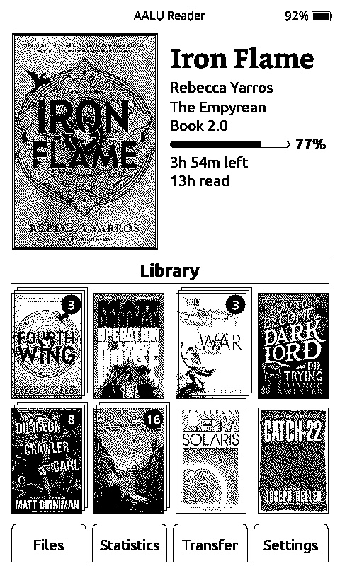
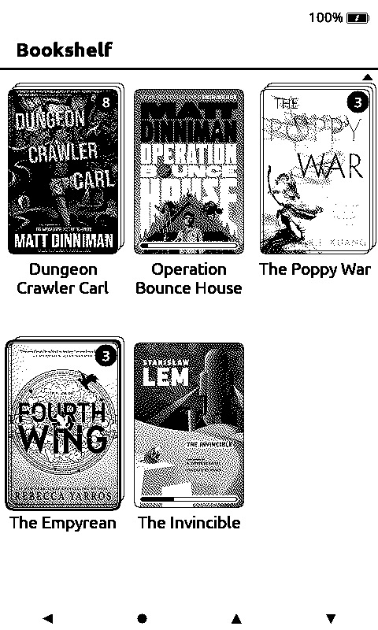
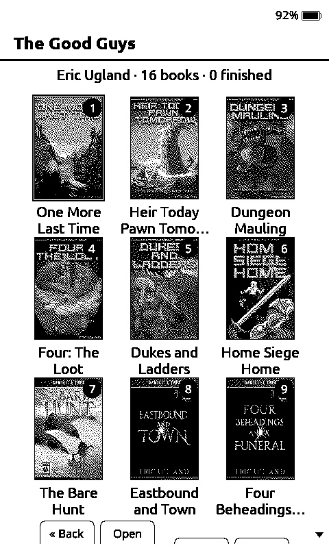
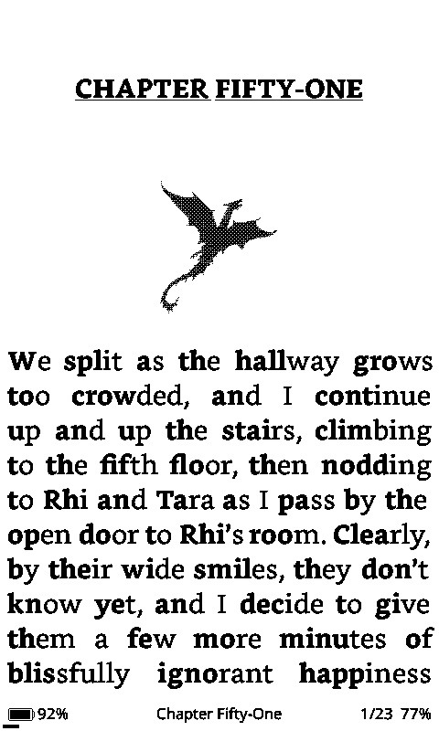
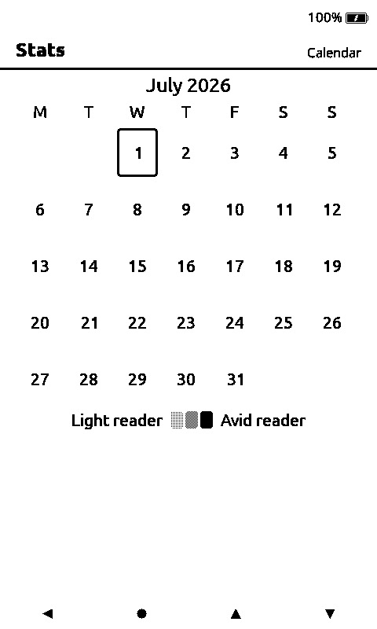

# AALU

> An open-source e-reader firmware for the **Xteink X4**, focused on organizing the books you actually read.

AALU is a custom firmware for the Xteink X4 e-paper reader, built for people who want a *personal* library experience — not just a viewer that opens EPUBs. Series get grouped automatically, finished books move out of the way, reading stats track what's worth tracking, and a long-press is all it takes to clean up the home screen. It runs on a 380KB-RAM ESP32-C3 and lives entirely on your device — no accounts, no telemetry, no cloud.

---

## Screenshots

| Home | Bookshelf | Series viewer |
| :---: | :---: | :---: |
|  |  |  |
| Hero book with a progress bar plus time-read / time-left readouts, a recents row with series-count badges, and the bottom menu (Bookshelf / Stats / Transfer / Settings). | Your whole library as a grid — every book, with series collapsed under a count badge. Long-press to delete, long-press Back to rescan. | Drill into a series stack: every member in reading order with a status badge — ▶ for the book you're reading, ✓ for finished. |

| Reading | Statistics — Calendar |
| :---: | :---: |
|  |  |
| In-book reading view with chapter title, body text, and a footer that shows battery, current chapter, page in chapter, and overall progress. | One of six stats views: a month heatmap shading each day by minutes read (Light → Avid). Page back through months with the side buttons. |

---

## Why this fork

AALU is forked from [**Seek Reader**](https://github.com/seek-reader/seek-reader), which itself builds on the excellent [CrossPoint](https://github.com/crosspoint-reader/crosspoint-reader) project — the EPUB engine, SD-caching layer, WiFi book upload, and OTA updates all come from that lineage.

I started this fork because I wanted my reader to help me *organize a reading life*, not just render pages:

- **Series, not files.** If a book belongs to a series, I want to see the series as a single tile on home and drill in to pick the next entry — not scroll through eight individual covers.
- **Reading vs. finished, separated.** A book at 100% shouldn't crowd the "what am I currently reading" view, and the stats screen shouldn't pretend a book I tapped once but never read is part of my reading history.
- **A clean home.** When I'm done with a book, I want it gone from the recents grid with a long-press, not stuck there forever.
- **Honest stats.** Hours, sessions, and pages-per-minute that survive deep-sleep cycles and don't get corrupted by a 5-second peek.

If any of that sounds like how you want your reader to behave, AALU is for you.

> *This project is **not affiliated with Xteink**. It's a community / personal project, built independently.*

---

## What's new in AALU

Everything below is on top of what Seek Reader / CrossPoint already do.

### Organizing your library
- **Automatic series grouping.** Books that share `calibre:series` or EPUB 3 collection metadata are bundled into a single home tile with a count badge. Folder-name fallback handles non-tagged collections.
- **Series viewer.** Open a stack tile to see every member of the series in reading order, with the most-recently-read book pre-focused for "continue reading" in one tap.
- **Bookshelf.** A full-library grid of every book on the card — not just recents — with series stacks collapsed behind a count badge. Long-press Confirm to delete a book, long-press Back to rescan the SD card.
- **File Browser (folder view).** Prefer folders to the cover grid? Settings → Display → Library View → File Browser swaps the Browse destination for a classic folder navigator that mirrors your SD card layout — fast for large, folder-organized libraries, and it sidesteps series grouping entirely. Bookshelf stays the default. Returning from a book reopens the browser at that book's folder.
- **Cover progress at a glance.** Individual covers carry a thin progress bar while you're mid-book and a check badge once finished — on Recents, Bookshelf, and the series viewer. Series stacks show their book-count badge instead.
- **Sharper covers.** Thumbnails are generated at their exact 2:3 on-screen size and Atkinson-dithered, so covers render crisp 1:1 instead of upscaled and smeared. Existing covers auto-upgrade to the sharper version as you browse — or all at once via long-press Back on the Bookshelf — with no cache wipe.
- **Recents shows only unfinished books.** Once a book is finished it drops off the home recents and the Carrousel automatically, so "continue reading" always lands on something you haven't finished yet.
- **Remove from recents.** Long-press Confirm (≥1 second) on a recents tile to clear it from home without deleting the file or losing your progress cache.

### Reading statistics, redone
- **Six stat views**, cycled with the Right button: Reading list, Finished list, Badges, Pet, Calendar, and a year-in-review "Wrapped".
- **All-time dashboard** — total reading hours, finished-books count, and current / longest streak.
- **Per-book analytics** — last session duration, total reading time, average pages-per-minute.
- **Reading companion.** A pet that levels up as you read: XP scales with pages turned and it evolves across 11 stages, cat → tiger → dragon (up to 30,000 XP). Its hunger and happiness decay hour-by-hour since your last session, so a steady habit keeps it thriving.
- **Reading calendar.** A month heatmap shading each day by minutes read (Light → Avid reader); page back through months with the side buttons — including months you didn't read.
- **Achievement badges.** Streaks (3 / 7 / 30 / 100 days), books finished (1 / 10 / 25 / 50), pages turned (1k / 10k / 100k), reading hours (10 / 50 / 100), plus early-bird and night-owl.
- **Stale-book filter** — books at 0% with 0 reading time stay hidden until you actually read them.
- **Deep-sleep protection** — sessions are saved on power-off, not lost.
- **Session guarding** — 3-minute minimum prevents short peeks from polluting the stats.
- **Self-healing progress** — finished books correctly read 100% (not 99%) across home, status bar, and stats.
- Binary migration engine keeps `stats.bin` current across firmware upgrades (now v8, after the pet and calendar data added new fields).

### Reader experience
- **In-reader Quick Settings overlay (Aa)** — fonts, sizes, margins, line spacing, layout — all adjusted *over* the book text. No full-screen settings round-trip, no flash hammering (writes are deferred), no E-ink ghosting.
- **On-device font downloads** — install extra reader fonts over Wi-Fi without a computer (Settings → Manage Fonts): browse a curated font catalog, download / update / remove families, each file streamed straight to the SD card and CRC32-verified on arrival. Installed families become selectable in the Aa overlay's font picker. Downloads stream in small chunks straight to SD rather than buffering whole responses in RAM, so they stay within the ~380KB budget.
- **Bionic Reading mode** — bolds the first few characters of each word to create fixation points that guide the eye through text. Toggle from the Aa overlay; works with any installed font family (Bookerly, Noto Sans, OpenDyslexic). Pure render-time effect — toggling does not invalidate the section cache, so flipping it back and forth is instant.
- **Offline English dictionary** — pixel-perfect word selection from EPUB text, StarDict format, Levenshtein-based "did you mean?" suggestions, memory-safe lookup history. *(Drop `dictionary.dict` and `dictionary.idx` onto the SD card — sample files in [`English-Dictionary/`](./English-Dictionary).)*
- **KOReader sync** — heuristic paragraph-level synchronization that fixes chapter drift and avoids crashing remote-device XML parsers.

### UI
- **Carrousel home style** — a cover-flow home screen (Settings → Display → Home style → Carrousel): five covers with your last-read book centered, progress painted on the cover, title + time-left below, and a Streak / Today's goal / Pet stats strip. Clock-less devices fall back to lifetime hours + books finished. Landscape shows the covers only. Flat (today's hero + thumbnails) stays the default.
- **Multiple home themes** — Classic, Lyra, Recent6 Grid (3×2, memory-safe).
- **Custom boot/sleep screens** — including a cat boot logo because why not.
- **Configurable button layout** — front button mapping plus page-nav swap.
- **Short power-button actions** — choose what a quick power tap does (Settings → Controls → Short Power Button Click): ignore, sleep, page turn, **Refresh Screen** (full-refresh to clear e-ink ghosting), or **Cycle Wallpaper** (show the next `/.sleep/` image). A long hold still sleeps.
- **Four orientations** — portrait, inverted portrait, landscape CW/CCW.

### Installing & recovery
- **SD-card firmware update** — drop `update.bin` on the SD-card root and install it from Settings → SD card firmware update, no cable required. Also works as the first-install path on a locked stock device (the stock bootloader picks it up at boot).
- **Recovery mode** — hold **Up + Power** at boot to jump straight to the SD update screen, even if the normal UI won't load.

### Stability
- **Heap-aware activity transitions** — the home screen's 48KB framebuffer cache is dropped before launching any sub-activity, so heap-hungry features (File Transfer's WiFi + WebServer + WebSockets) get the room they need.
- **Cascading cover fallbacks** — when a cover thumb isn't on disk at the resolution stats wants, we render from the home page's pregenerated thumb so the page never shows a blank cover.

---

## Hardware

- **Device:** Xteink X4
- **MCU:** ESP32-C3 (single-core RISC-V, 160 MHz)
- **RAM:** ~380KB usable, no PSRAM (this is the primary design constraint — every feature pays an explicit memory budget)
- **Storage:** 16MB flash + microSD card (for books and aggressive caching)
- **Display:** 800×480 monochrome E-ink, single 48KB framebuffer

The official Xteink firmware can always be restored via their web flasher: <https://xteink.dve.al/>.

---

## Installing / flashing AALU

There are a few distinct ways to get AALU onto an X4, and which one applies depends on your device's state (unlocked vs. locked stock firmware) and whether it's already running AALU. They are **not interchangeable** — pick the row that matches you.

Every release publishes two files that are byte-for-byte the same firmware under two names:

- **`firmware.bin`** — the app image, used by the web flasher, `esptool`, and Wi-Fi OTA.
- **`update.bin`** — the exact same bytes renamed, used by the SD-card update paths (the stock bootloader and AALU's in-firmware updater both look for this name).

> **All flashing paths write the AALU app at offset `0x10000`. Never write to `0x0`** — that overwrites the bootloader and bricks the device.

### Already-unlocked device, over a USB cable

If your X4 accepts USB flashing (developer-unlocked), the simplest routes are:

- **Web flasher** — open <https://xteink.dve.al/>, choose **Custom .bin**, and select AALU's `firmware.bin`.
- **esptool CLI:**

  ```bash
  pip install esptool
  esptool.py --chip esp32c3 --port <YOUR_PORT> --baud 921600 write_flash 0x10000 firmware.bin
  ```

  Replace `<YOUR_PORT>` with your serial port (macOS `/dev/cu.usbmodem*`, Linux `/dev/ttyACM*`/`ttyUSB*`, Windows `COMx`).

### Locked stock device — first install via SD card (`update.bin`)

Stock X4 units are locked so that **USB flashing is disabled**, but SD-card updates still work. To install AALU for the first time on such a device:

1. Download AALU's `update.bin` (or rename a downloaded `firmware.bin` to `update.bin`).
2. Copy it to the **root** of the SD card (FAT32 or exFAT).
3. Insert the card, connect USB power, and hold **Power + Up** (the top side button) as the device powers on.

This triggers the **closed stock Xteink bootloader** (not AALU code) to detect `update.bin` at the SD root and write it to the app partition. The Power + Up combo here is the *stock bootloader's* documented X4 update trigger — coincidentally the same buttons AALU later uses for its own recovery mode, but an entirely separate mechanism (AALU's hook only exists once AALU is flashed). Because this path depends on closed stock firmware, confirm the exact combo for your unit before relying on it; it works at all only because the lock disables USB flashing, not SD updates. You **must** use the **X4** image — a wrong-model image is the real brick risk.

### Locked device via the Wi-Fi Unlocker

A third-party **Xteink Unlocker** tool exists for locked devices. Note that **AALU is not in its hardcoded list of supported firmwares** — it's a third-party tool outside this project's control, and we can't guarantee it behaves with AALU. For locked devices, the supported path is the `update.bin` SD-card install above.

### Device already running AALU

Once AALU is on the device, you have three ways to update it:

- **In-firmware SD update** — put `update.bin` on the SD-card root, then go to **Settings → SD card firmware update** and confirm.
- **Recovery mode** — hold **Up + Power** at boot to jump straight to the SD update screen, even if the normal UI won't load (useful after a bad flash or a USB lock).
- **Wi-Fi OTA** — the existing "check for updates" flow downloads and installs over the network.

### Safety caveats

- **Do not power off during flashing.** Keep the battery charged before you start.
- **Use the X4 image.** A wrong-model image is the one thing that can genuinely brick the device.
- The firmware must fit a single OTA slot; the released images already do.
- The locked-device `update.bin` path depends on closed stock firmware behaviour we don't control — validate it on your own device before relying on it.

---

## Building from source

AALU is built with PlatformIO. To compile and flash it yourself over USB-C:

### Prerequisites

- **PlatformIO Core** (`pio`) — install with `pip install platformio` or use the VS Code PlatformIO IDE extension
- **Python 3.8+**
- **USB-C cable**
- **Xteink X4 device**

### Clone

```bash
git clone --recursive https://github.com/dawsonfi/aalu.git

# If you already cloned without --recursive:
git submodule update --init --recursive
```

### Flash

Connect the X4 over USB-C, then:

```bash
pio run --target upload
```

The default build is the development environment with serial logging on. For a slimmer release build:

```bash
pio run -e gh_release --target upload
```

### Monitor (optional, for debugging)

```bash
python3 -m pip install pyserial colorama matplotlib

# macOS — explicit port:
python3 scripts/debugging_monitor.py /dev/cu.usbmodem2101

# Linux / Windows (Git Bash) — auto-detects:
python3 scripts/debugging_monitor.py
```

---

## Using it

See [USER_GUIDE.md](./USER_GUIDE.md) for the day-to-day operation reference. The short version:

- **Confirm** on a tile to open a book, a series viewer, or a menu item.
- **Long-press Confirm** on a recents tile to remove it from home (or on a Bookshelf book to delete it).
- **Back** to go up a level; **long-press Back** in the reader to jump home, or on the Bookshelf to rescan the card.
- **Right** in Stats cycles the six views (Reading, Finished, Badges, Pet, Calendar, Wrapped); **Up/Down** page months in the Calendar.
- **Aa** while reading to open the Quick Settings overlay.
- **Home style** (Settings → Display) switches between **Flat** (hero + thumbnails) and **Carrousel** (cover-flow). In Carrousel, **Left/Right** rotate the covers, **Confirm** opens the centered book, and **Up/Down** move focus to the bottom menu.

---

## Internals — the 380KB constraint

The ESP32-C3 has **~380KB of usable RAM**, of which the E-ink framebuffer alone consumes 48KB. AALU is aggressive about caching to the SD card so the working set stays small.

### Cache layout (on the SD card)

```
.crosspoint/                      # name retained for backward-compat with existing caches
├── epub_<hash>/
│   ├── progress.bin              # spine index + page within chapter
│   ├── book.bin                  # metadata: title, author, spine, ToC, series
│   ├── thumb_<height>.bmp        # cover at one or more pre-rendered resolutions
│   └── sections/
│       ├── 0.bin                 # per-chapter render cache (page LUT, layout, images)
│       └── ...
├── stats.bin                     # global + per-book reading statistics
├── home_progress.json            # fast-path home progress cache
└── recent.json                   # the recents list (the home grid)
```

Cache is keyed by file path. Moving or renaming a book gives it a new hash and a fresh cache; the old cache becomes an orphan you can ignore or sweep.

Deleting `.crosspoint/` clears everything — every book gets re-parsed on next open, every cover regenerated. Use sparingly; chapter cache rebuilds are the slow path.

### When does the cache invalidate?

- **Cache format version changes** — `book.bin`, `section.bin`, `stats.bin` all have version constants that trigger rebuild on mismatch.
- **Render settings change** — font, size, margins, line spacing, paragraph spacing, screen margin.
- **Viewport changes** — orientation or display resolution.
- **Book file moved or renamed** — different path → different hash → new cache.

For the gory format details, see [`docs/file-formats.md`](./docs/file-formats.md).

---

## Roadmap / status

AALU is **actively developed** — I'm using it as my daily reader and shaping it as I go. Recent work has landed:

- ✅ SD-card `update.bin` flashing + Up + Power recovery mode (no cable required; first-install path for locked devices)
- ✅ Carrousel home style — a cover-flow home with progress-on-cover and a Streak / Goal / Pet stats strip
- ✅ Reading companion (pet) that evolves cat → tiger → dragon as you read
- ✅ Stats calendar heatmap, achievement badges, and a "Wrapped" year-in-review
- ✅ Cover progress bars + completed badges on Recents, Bookshelf, and the series viewer
- ✅ Bookshelf — a full-library grid with series stacks and long-press delete
- ✅ Series stacks on home + drill-in series viewer
- ✅ Statistics overhaul (Reading / Finished views, stale-book filter)
- ✅ Long-press to remove from recents
- ✅ 100%-not-99% progress fix across home / stats / reader

On the radar:

- 📋 Remove individual books from inside the series viewer
- 📋 Mtime-based EPUB cache invalidation (so editing an EPUB in place refreshes its metadata without manual cache clear)
- 📋 More UI themes
- 📋 Per-book notes / highlights

If any of those would matter to you, open an issue or PR.

---

## Developing

### Desktop simulator

AALU compiles as a native desktop app via the [`uxjulia/crosspoint-simulator`](https://github.com/uxjulia/crosspoint-simulator) PlatformIO library — same `src/` + `lib/` code as the device, rendered into an SDL2 window. Useful for UI iteration, EPUB parsing, dictionary, stats, and any logic that isn't tied to actual e-ink/FreeRTOS behaviour.

#### Running it

```bash
brew install sdl2     # one-time prereq (macOS)

make emulator         # build, mount ./sdcard/, launch
make sim-build        # build only → .pio/build/simulator/program
make sim-clean        # wipe build cache + ./sdcard/.crosspoint/
```

Native Windows is not supported by the underlying simulator library; use WSL with `libsdl2-dev` instead.

#### Putting books on it

`make emulator` creates `./sdcard/` (gitignored) at the repo root on first run and exposes it as the sim's SD-card filesystem. Device SD root → `./sdcard/`.

```bash
# Drop loose EPUBs
cp ~/Downloads/MyBook.epub sdcard/

# Or snapshot a real SD card
cp -R /path/to/sdcard/. sdcard/

# Or replace ./sdcard/ outright with a symlink to a mounted SD card
rm -rf sdcard fs_
ln -s /Volumes/your-sd-card sdcard
```

The sim internally hardcodes its sandbox path to `./fs_/`. The Makefile keeps `fs_` as a symlink to `sdcard/` so the user-facing folder has an intuitive name. You can ignore `fs_` — touch `sdcard/` only.

`.crosspoint/` cache from a real device works *only* when the sim runs at the same panel resolution (800×480) and identical render settings — otherwise `rm -rf sdcard/.crosspoint/` before launching.

#### Input

| Key | Physical button |
|---|---|
| ↑ / ↓ | Side buttons (`BTN_UP` / `BTN_DOWN`) |
| ← / → | Front `BTN_LEFT` / `BTN_RIGHT` |
| Return | `BTN_CONFIRM` |
| Escape | `BTN_BACK` |
| P | `BTN_POWER` |
| S | Simulator sleep request |

AALU's `MappedInputManager` does the same physical → logical translation as on the device — front-button remapping in Settings → Button Remap applies in the sim too.

#### What the sim does NOT replace

- **No e-ink ghosting or refresh latency** — SDL repaints instantly.
- **No 380KB RAM ceiling** — host has GB; leaks pass silently.
- **No FreeRTOS scheduling** — `std::thread` + condvars, different semantics.
- **No Wi-Fi / OTA / Bluetooth / battery / deep sleep** — stubbed or no-op.

The four-orientation hardware checklist is still required before declaring any visual or input change done.

---

## Contributing

Contributions are very welcome. The constraints to keep in mind:

1. **The 380KB RAM ceiling is non-negotiable.** Justify any new heap allocation or explain why a stack/static alternative was rejected.
2. **Use the HAL** (`HalDisplay`, `HalGPIO`, `HalStorage`) — don't reach into the SDK directly.
3. **i18n everything user-facing.** All UI strings go through `tr(STR_*)` and live in `lib/I18n/translations/*.yaml`.
4. **Test all four orientations.** Many bugs hide in just one.
5. **No emojis in code, no comments that just describe what the code does.** Comment only the *why* when it's non-obvious.

### Workflow

1. Fork
2. Branch: `feature/your-cool-idea`
3. Make changes, follow the project's coding guidelines in `CLAUDE.md` (or `GEMINI.md` for the equivalent Gemini-flavored doc)
4. `pio run` must pass cleanly; run the host tests under `test/`
5. Open a PR

---

## Credits

- [**Seek Reader**](https://github.com/seek-reader/seek-reader) — the direct upstream this fork builds on.
- [**CrossPoint**](https://github.com/crosspoint-reader/crosspoint-reader) — the original EPUB engine and SD-caching architecture that all of this stands on.
- [**diy-esp32-epub-reader** by atomic14](https://github.com/atomic14/diy-esp32-epub-reader) — inspiration for the original architecture.
- Everyone who has flashed this firmware, filed an issue, or shared a fix.

## License

See [LICENSE](./LICENSE).
