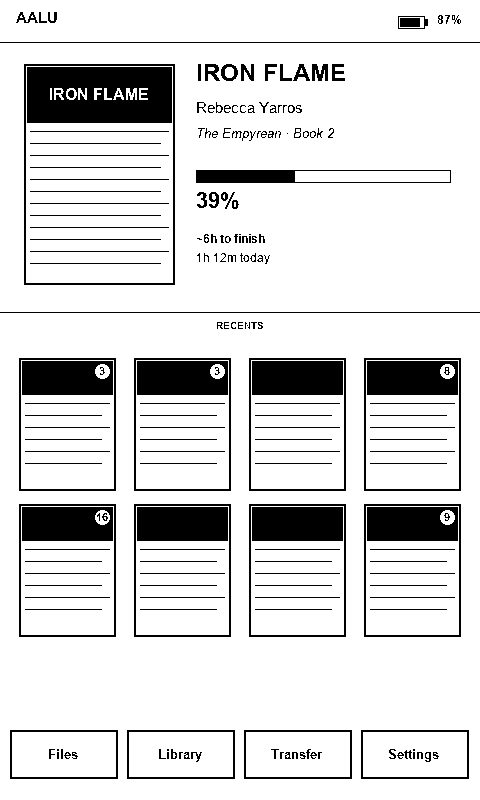
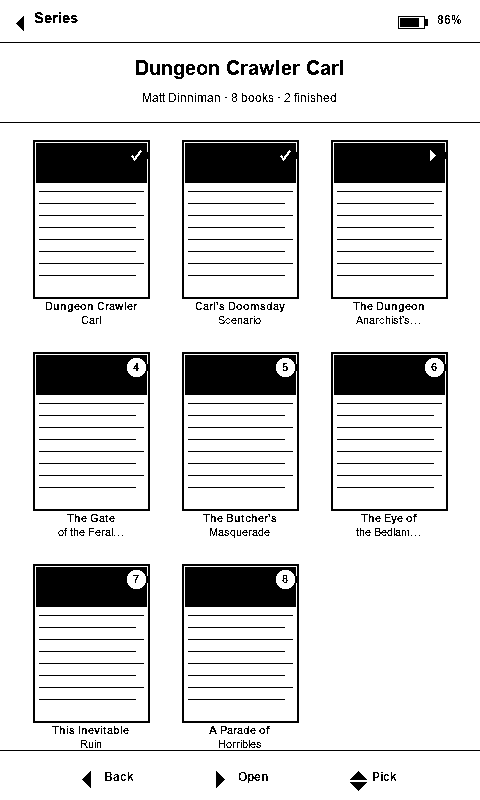
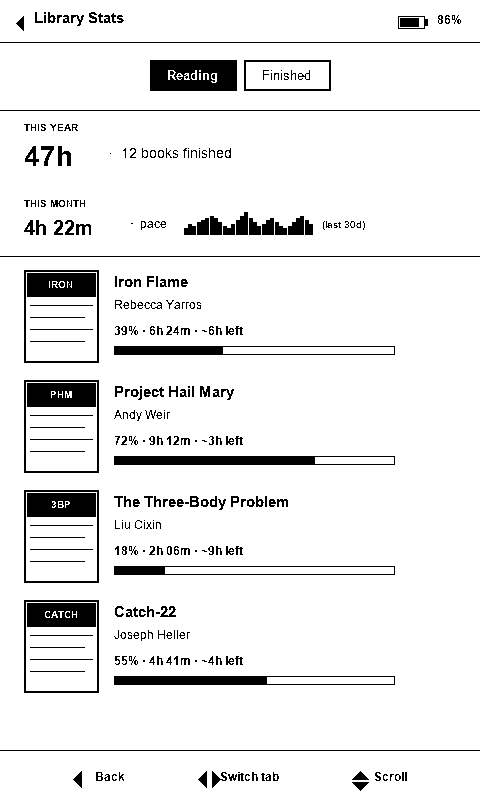

# AALU — UX Redesign & Feature Backlog

> A design-only document. Mockups are blueprints, not commitments. Implementation is deliberately deferred to follow-up work.

---

## 0. Front Matter

### 0.1 Purpose

AALU has grown from a Xteink stock-firmware replacement into a *daily-driver e-reader with opinions*. The IA is mature in places (series stacks, the stats v2.5 split, the Aa overlay) and crude in others (the in-reader Confirm menu, the file browser, error states across the network screens). This doc is an outside audit that finds the wrinkles you've stopped noticing and proposes concrete fixes.

It also proposes a feature backlog that pushes lightly past the current `SCOPE.md` — keeping the device's "dedicated reader" identity intact while opening the door to reading-adjacent WiFi features.

### 0.2 Audience

- **Primary**: the project author. Use this as a triage source — pick the items that match your itch.
- **Secondary**: future contributors. Each finding and feature is self-contained enough that a drive-by contributor could pick one up.

### 0.3 Non-goals

- **Not an implementation plan.** No heap budgets, no PR-ready code. Where a proposal has obvious risk (e.g. requires an extra 16 KB buffer), it's flagged, not solved.
- **Not a visual brand redesign.** I'm not proposing a new logo or a new theme name. Theme system is reviewed in §3.7.
- **Not an exhaustive nit list.** I deliberately stop short of "this margin is 2 px off." Anything below the threshold of "a user could feel this" was dropped.

### 0.4 Hardware constraints — referenced by every finding

| Constraint | Value | Implication for UX |
| --- | --- | --- |
| RAM | ~380 KB (no PSRAM) | No double-buffering tricks. Every overlay competes with the framebuffer for room. |
| Framebuffer | 48 KB, single | Any partial-update flicker is visible; full clears cost ~1–2 s. |
| Display | 800×480 monochrome E-ink | No animation, no gradient feedback, ghosting accumulates. |
| Refresh | ~300 ms partial, ~1.5 s full | Multi-step screens (e.g. typing a WiFi password) compound latency. |
| Input | 4 main buttons (Back / Confirm / Left / Right) + Power / Vol± | No touch, no swipe, no gesture. Discoverability is the hardest UX problem. |
| Flash | 16 MB | Plenty for binaries, but every setting written = a flash erase cycle. |

Throughout this doc, "free heap is tight" means "this proposal pushes against the 380 KB ceiling and should be heap-budgeted at design time" — not "it's impossible."

### 0.5 Methodology

1. Read every activity in `src/activities/` (render + lifecycle + input handling).
2. Cross-reference with the two committed screenshots (`docs/images/screenshots/home.jpeg`, `series-viewer.jpeg`) and the README/USER_GUIDE descriptions.
3. Audit each screen against four lenses: **information architecture**, **affordance** (does the user know what to press?), **feedback** (does the screen tell them what happened?), **E-ink fit** (does it fight or work with the panel?).
4. Surface findings ranked by severity. Where worth mocking, draw ASCII. Otherwise prose.

---

## 1. Proposed `SCOPE.md` Amendment

### 1.1 Current state

The existing `SCOPE.md` rules out *Active Connectivity* ("RSS, news aggregators, web browsers") and *Interactive Apps*. The de facto policy already violates this — Calibre Wireless, KOReader Sync, and the existing OPDS browser are all WiFi-mediated. So the written scope and the codebase have drifted apart.

### 1.2 Proposed carve-out (verbatim text to drop into SCOPE.md)

> #### Reading-adjacent Connectivity (carve-out, added 2026)
>
> The "no active connectivity" rule is relaxed for features that demonstrably enhance the act of reading. The qualifying tests, in order:
>
> 1. **Does it touch the user's books, library, or reading progress?** If yes, candidate.
> 2. **Is the network use bursty and user-initiated** (a one-shot pull when the user enters a screen), rather than a background daemon? If yes, candidate.
> 3. **Does the feature gracefully degrade when WiFi is unavailable?** If yes, candidate.
>
> A feature must clear all three.
>
> **In-scope examples:** OPDS catalog browse + download, cover/metadata enrichment from Open Library, KOReader-style progress sync, highlights sync to file-based services, dictionary pack download, "send to AALU" gateway, Wikipedia preview on word-select.
>
> **Still out-of-scope:** web browser, RSS reader as standalone app, weather, clock, email client, music player, social feeds, anything with a persistent connection or background polling.
>
> **Gray-zone — case-by-case (Tier 3 in the UX redesign doc):** Goodreads integration (now committed — see §4.3.1), library borrowing (Libby/OverDrive) catalog-only, read-it-later (Wallabag / Pocket / Omnivore) article fetching, RSS-as-EPUB digest generation. Each requires its own discussion before being adopted.

### 1.3 Why this works

The three tests are deliberately strict. A weather widget fails test 1. A background RSS poller fails test 2. A streaming music app fails test 2 and 3. Goodreads passes 1 and 2 but creates a complicated dependency on a third-party API with rate limits, which is why it's gray, not green.

This amendment turns the absence of policy into a one-sentence litmus test, which is what a maintainer actually needs to reject PRs without arguing.

---

## 2. UX Audit — per-screen

Each finding is structured: **What's there** → **What's wrong** → **Proposal** → **Effort × Risk**.

Effort: **S** (afternoon), **M** (1–2 days), **L** (a week or more).
Risk: **heap** (RAM pressure), **flash** (write frequency), **refresh** (E-ink ghosting / cost), **scope** (feature creep), **none**.

### 2.1 Boot & Sleep

#### 2.1.1 BootActivity

**Current**: A boot logo screen, including (per the README) "a cat boot logo because why not."

**Finding**: I haven't read this screen's render code in depth, but boot screens on E-ink typically miss one trick: they're a free chance to *prefetch* the cover of the book that's about to open. The user's eyes are already on the screen; an extra 600 ms of "loading X by Y" with cover thumb beats a generic logo.

**Proposal**:

```
+----------------------------------------+
|                                        |
|              [AALU logo]               |   ← branded boot (~300ms)
|                                        |
+----------------------------------------+

then (if last-opened book exists, ~600ms more):

+----------------------------------------+
|        +-------+                       |
|        |       |                       |
|        | COVER |   Iron Flame          |
|        |       |   Rebecca Yarros      |
|        +-------+   The Empyrean · #2   |
|                    39% · ~6h left      |
|                                        |
|        Resuming…                       |
+----------------------------------------+

then enters reader at saved position.
```

The "resuming" screen makes the boot-into-reader feel intentional rather than blank. "~6h left" reads `pages_remaining / avg_pages_per_min` from stats — you already track this.

**Effort × Risk**: M / heap (cover thumb already in cache, but it's an extra render pass during a constrained boot path) / refresh (one extra full refresh)

#### 2.1.2 SleepActivity

**Current**: Sleep screen showing Dark / Light / Custom / Cover / None / Cover+Custom per settings. 389 LOC suggests it's already feature-rich.

**Finding**: The setting names (`Dark`, `Light`, `Cover + Custom`) are descriptive enough but the *Cover Filter* and *Cover Mode* settings are tucked under the same Display category they belong to but live in a flat enum scroll. A user who picks "Cover" probably also wants to set Filter and Mode immediately. They're three separate settings rows in a list of 10+.

**Proposal**: Surface the dependent settings *inline* when the parent is set to Cover (or Cover+Custom). Settings rows for `Sleep Cover Mode` and `Sleep Cover Filter` get hidden when not applicable. Pseudo-mockup of settings tab:

```
Display
─────────────
> Sleep Screen                  [Cover]
    ↳ Cover Mode                [Fit]
    ↳ Cover Filter              [None]
  Status Bar             [Full w/ Bar]
  Refresh Frequency            [10 pg]
  UI Theme                    [Classic]
```

The indented sub-settings only appear when the parent is set to a value that uses them. Reduces "what does that setting do, again?" trips back to the docs.

**Effort × Risk**: S / none

### 2.2 Home & Library

#### 2.2.1 HomeActivity

**Current** (verified from screenshot + `HomeActivity.cpp:738`):
- Header bar with brand text ("AALU Reader") + battery percent.
- Hero strip: large cover (left), title / author / series (right), large circular progress ring with percent.
- Divider line.
- "Recent Reads" centered section label.
- 4×2 grid of cover thumbs with numeric stack-count badges.
- Bottom 4-tile menu (Files / Statistics / Transfer / Settings).

**Finding 1 (high severity) — Hero metadata is over-truncated and over-prioritized.** Looking at the screenshot, the third line reads "The Empyrean · Book…" — it's truncated mid-word. The series name + book number is information that *matters* (you literally built series support); truncating it is one of the most visible bugs in the screenshot. Worse, the title-author-series block is essentially three roughly-equal lines competing for visual weight; the eye doesn't know what to land on.

**Finding 2 (medium) — The circular progress ring is the most prominent thing on screen but tells you less than the percentage does.** A 39% ring next to "39%" is double-counting. On 800×480 mono, the ring is mostly noise; ghosting potential is high because the unfilled arc is a heavy black line.

**Finding 3 (low–medium) — "Recent Reads" is a centered all-caps section label with a divider above it. Old-school but loud.** Worth aligning with the cleaner Hawkins-style "minimal label, hairline above it" pattern. Also "Recents" is sufficient — "Reads" is implied by the cover thumbnails.

**Finding 4 (medium) — Battery indicator has a percent but no icon, and no time estimate.** On a device that runs for weeks, "87%" is less informative than "≈4 days." If you have battery telemetry over time you can compute this; if not, even a battery icon would be clearer than a bare number.

**Proposal — redesigned home (mock at 480×800 portrait)**:



*Rendered at native device resolution, 1-bit, no anti-aliasing. ASCII blueprint below is the precise spec; the PNG above is the visual gestalt.*


```
+-------------------------------------------------------+
| AALU                                       ▮▮▮▮▯ 87%  |   ← icon + %
+-------------------------------------------------------+
|                                                       |
|  +-----------+    IRON FLAME                          |   ← title XL bold
|  |           |    Rebecca Yarros                      |   ← author M
|  |   COVER   |    The Empyrean · Book 2               |   ← series italic
|  |           |                                        |
|  |           |    ████████░░░░░░░░░░░░ 39%            |   ← linear bar
|  |           |    ~6h to finish · 1h 12m today        |   ← *new* signal
|  +-----------+                                        |
|                                                       |
| ─── Recents ─────────────────────────────────────────  |   ← hairline + small
|                                                       |
| ┌────┐ ┌────┐ ┌────┐ ┌────┐                           |
| │ 3  │ │ 3  │ │    │ │ 8  │                           |   ← 4 thumbs row 1
| └────┘ └────┘ └────┘ └────┘                           |
| ┌────┐ ┌────┐ ┌────┐ ┌────┐                           |
| │ 16 │ │    │ │    │ │ 9  │                           |   ← 4 thumbs row 2
| └────┘ └────┘ └────┘ └────┘                           |
|                                                       |
| ┌───────┬───────────┬──────────┬──────────┐           |
| │ Files │  Library  │ Transfer │ Settings │           |   ← changed
| └───────┴───────────┴──────────┴──────────┘           |
+-------------------------------------------------------+
```

What changed:

- **Hero typography hierarchy**: Title at UI_XL bold, author at UI_M regular, series at UI_M italic. Three sizes/weights, not three siblings.
- **Circular ring → linear bar**: less ink, less ghosting, easier to read at glance, leaves room for *secondary* progress info (`~6h to finish · 1h 12m today`). That secondary line is the highest-leverage new piece of information you can add to home — it answers "should I crack this open right now?" which is what a reader actually wants to know on the home screen.
- **Section label**: "Recents" instead of "RECENT READS." Hairline below the hero, small uppercase. Less ceremony.
- **Battery**: icon + percent. Optional: replace percent with "~4 days" if you have enough samples (this is a Tier 1 future feature, §4.4.6).
- **Bottom menu**: rename "Statistics" → "Library" *if* you adopt the unified library/stats merge proposed in §2.6. Otherwise keep "Statistics." The tile sizes don't need to be equal — "Files" is shorter, so it can be narrower; "Transfer" is wider; "Library" / "Settings" centered between.

**What I deliberately did NOT propose**:

- I didn't suggest removing the 4×2 grid. It works. The stack-count badge is genuinely useful and original.
- I didn't suggest a fancy hero animation or fade. E-ink. No.
- I didn't suggest replacing the hero with the user's whole library, because the "what should I read next?" affordance on this firmware is *already* the recent grid; the hero is correctly for the *current* read.

**Effort × Risk**: M / refresh (one full redraw to migrate, then same cadence) / none ongoing

#### 2.2.2 SeriesViewerActivity

**Current** (verified from `series-viewer.jpeg` + source): Title at top, "8 books" subtitle, 3-column grid of covers numbered 1–N, truncated title below each, "« Back" / "Open" footer.

**Finding 1 (high) — Footer is cut off in the actual screenshot.** Looking at `series-viewer.jpeg`, the bottom 1–2 rows of pixels show truncated button chrome under "« Back" and "Open." Whether this is the screenshot tool's fault or a real layout bug, the proximity-to-screen-edge says the bottom safe area isn't being respected.

**Finding 2 (medium) — Title under each cover is truncated mid-word, *unnecessarily.*** "Dungeon Cr…", "Carl's Doo…", "The Dunge…" — every label loses signal at the suffix when the most distinguishing part of a series title is usually the *trailing* phrase, not the first word ("Carl's Doomsday Scenario" vs "Carl's Bedtime Story"). For a series viewer where every book starts with the same author cadence, trailing truncation is exactly wrong.

**Finding 3 (low) — The "most-recently-read pre-focused" behavior is invisible.** README says the series viewer pre-focuses the last-read book in the series. The selected border is the only indication. You could mark the *current* book ("you're on book 2") and the *last-finished* book ("✓ book 1") with subtle chrome so the user can see their place in the series at a glance.

**Proposal**:



*Status glyphs: filled circle + check = finished, filled circle + ▶ = currently reading, hollow circle + number = unread. ASCII blueprint below for precise specs.*

```
+-------------------------------------------------------+
| ← Series                                  86% ▮▮▮▮▯   |
|                                                       |
|  Dungeon Crawler Carl                                 |   ← series title L bold
|  Matt Dinniman · 8 books · 3 finished                 |   ← new: author + status
|                                                       |
|  ┌──────┐  ┌──────┐  ┌──────┐                         |
|  │  ✓   │  │  ✓   │  │ ▶ 3  │                         |   ← ✓ finished / ▶ reading
|  │ COVER│  │ COVER│  │ COVER│                         |
|  └──────┘  └──────┘  └──────┘                         |
|  Dungeon   Carl's    The Dungeon                      |   ← 2-line wrap, not trunc
|  Crawler   Doomsday  Anarchist's…                     |
|  Carl      Scenario  Cookbook                         |
|                                                       |
|  ┌──────┐  ┌──────┐  ┌──────┐                         |
|  │   4  │  │   5  │  │   6  │                         |
|  │ COVER│  │ COVER│  │ COVER│                         |
|  └──────┘  └──────┘  └──────┘                         |
|  The Gate  The      The Eye                          |
|  of …      Butcher's of Be…                          |
|                                                       |
|  ┌──────┐  ┌──────┐                                   |
|  │   7  │  │   8  │                                   |
|  └──────┘  └──────┘                                   |
|                                                       |
|  ◀ Back     ▶ Open                            ▼ More  |   ← single hint row
+-------------------------------------------------------+
```

Changes:

- **Header**: explicit "← Series" back affordance, battery on right (consistent with home).
- **Subtitle line**: author + book count + finished count. Free, useful, currently absent.
- **Badge**: replace pure-number with a 2-state-aware glyph. `✓` for finished, `▶ N` for the currently-reading book, plain `N` otherwise. Now the user can scan a series and see "I'm on book 3, I've finished 1–2" in one read.
- **Title wrap**: 2 lines instead of 1, with mid-word truncation only on overflow. The screenshot wastes valuable vertical space below each cover.
- **Footer**: respect the safe area. The bottom-cut bug is fixed by giving the button hints a stable 50 px reserved row.

**Effort × Risk**: M / none

#### 2.2.3 FileBrowserActivity

**Current** (`FileBrowserActivity.cpp:272`): Header with current folder name, generic `GUI.drawList` showing files with icons (when theme supports), button hints at bottom (Home / Open / Up / Down).

**Finding 1 (medium) — Empty state is a bare string ("No files found") with no recovery affordance.** A user who sees this on a freshly-flashed device should be told *what to do next*: "Use Transfer to add books, or insert an SD card with EPUBs in any folder."

**Finding 2 (medium) — No file metadata in the list.** It's a flat name list. For an EPUB browser, file *size* and *modified date* are useful. For folders, *book count* is useful. Without them, the user has to open a folder to know if it's empty.

**Finding 3 (low) — Long-press Back goes home; long-press Confirm deletes (with confirmation). Both are non-obvious.** The button hints row only shows the short-press action. A user discovers these from the manual, not the UI.

**Proposal**:

```
+-------------------------------------------------------+
| ← /Books/Sci-Fi                          86% ▮▮▮▮▯    |
|                                                       |
| ┌───────────────────────────────────────────────────┐ |
| │ 📁 Murderbot Diaries        7 books               │ |
| │ 📁 Bobiverse                4 books               │ |
| │ 📕 Project Hail Mary.epub   2.4 MB · 3w ago       │ |
| │ 📕 The Three-Body Problem   1.8 MB · 2m ago       │ |
| │ 📕 Sundiver.epub            712 KB · 4m ago       │ |
| │ ...                                               │ |
| └───────────────────────────────────────────────────┘ |
|                                                       |
| ◀ Up dir    ▶ Open       (hold ◀ = home, ▶ = delete) |
+-------------------------------------------------------+
```

Empty state:

```
+-------------------------------------------------------+
| ← /                                                   |
|                                                       |
|         No books found on this SD card.               |
|                                                       |
|         To add books:                                 |
|         • Insert an SD card with EPUBs, or            |
|         • Use Transfer (home → Transfer) to           |
|           upload from your computer over WiFi.        |
|                                                       |
|                                                       |
| ◀ Home                                                |
+-------------------------------------------------------+
```

Changes:

- **List items**: file size + modified date for files; book count for folders. Stats v2.5 already tracks last-opened per book — surface "3w ago" for books that have stats.
- **Long-press affordance**: a small parenthetical hint row beneath the main button hints. Not maximally elegant, but on a device with 4 buttons, hidden gestures are the alternative to hidden gestures.
- **Empty state**: actionable, with a pointer to the recovery path.

**Effort × Risk**: M (metadata fetching adds I/O) / heap (folder book counts require directory scan; cache the result)

### 2.3 Reader — main loop

#### 2.3.1 EpubReaderActivity — the page

**Current** (`EpubReaderActivity.cpp:837` and the renderStatusBar at 936): The book text fills the viewport with configurable margins. A status bar can be drawn at the top with chapter/book progress, battery, etc. Per Display Settings: None / No Progress / Full w/ Percentage / Full w/ Book Bar / Book Bar Only / Full w/ Chapter Bar.

**Finding 1 (high) — Six status-bar variants is two too many.** "No Progress" vs "Full w/ Percentage" vs "Full w/ Book Bar" vs "Book Bar Only" vs "Full w/ Chapter Bar" — most users will toggle through them once and pick one. The configuration surface costs you complexity in StatusBarSettingsActivity and confuses anyone trying to figure out "wait, which one was the bar?"

**Finding 2 (medium) — Status bar has no place for *time*.** Many e-readers show "32 min left in chapter" or "current clock time" at the top of the page. Clock is correctly ruled out per SCOPE (RTC drift). But "min left in chapter" / "min left in book" is computed locally from your existing stats and is the highest-value bit of chrome you could add.

**Finding 3 (low) — Pages turn without a "tap target" hint.** A user who doesn't read the manual has to discover the page-turn buttons. A first-launch reader tutorial would solve this once, but reader-internal hints (a thin chevron at the bottom-right of the first page of a new chapter for the first 5 chapters? a tutorial mode toggle?) is worth considering.

**Proposal — collapse the 6-variant status bar into 3 with smarter content**:

| New variant | Replaces | Contents |
| --- | --- | --- |
| **None** | None | (nothing) |
| **Minimal** | No Progress, Book Bar Only | Hairline at top with a single thin progress bar across the full width. Nothing else. |
| **Full** | Full w/ Percentage, Full w/ Book Bar, Full w/ Chapter Bar | Top strip: chapter title (left, truncated), `12m left` (center), `41% / 6h12m` (right). Below that, an optional hairline bar (default off). |

The new "Full" replaces three of the old variants with one richer-looking bar that adds two new signals (chapter title, time-left).

```
Chapter 7 · The Tower               12m left          41% · 6h12m
─────────────────────────────────────────────────────────────────
                                                                 
The dragon swept low over the city, …                            
                                                                 
```

Time-left calculation: `pages_remaining * avg_seconds_per_page` from existing stats. When stats are too thin (new book, <20 minutes read), show `~12m` with a tilde or fall back to "12 pg."

**Finding 4 (medium) — The Confirm button opens the reader menu. The reader menu is far too long.** See §2.3.2.

**Effort × Risk**: M (status bar simplification + new content) / scope (you're removing user-visible settings; flag in changelog)

#### 2.3.2 EpubReaderMenuActivity — the Confirm menu

**Current** (`EpubReaderMenuActivity.cpp:30`): Flat scrolling list of up to 13 items: Select Chapter, Footnotes, Orientation (inline value), Auto Turn Pages (inline value), Go To %, Screenshot, Display QR, Go Home, Sync Progress, Delete Cache, Quick Settings, Lookup, Lookup History.

**Finding (high, top-3 issue in the whole codebase) — This menu is a junk drawer.** Thirteen items, no grouping, no priority. Items range from "I press this every time I open a chapter" (Select Chapter) to "I press this once every two months" (Delete Cache). Quick Settings is buried at position 11 — but Quick Settings is the menu the user wants *most often* after Select Chapter. Items that change a value (Orientation, Auto Turn Pages) are mixed with items that open new screens (Lookup, Chapter Select). The user has no model of what's "click to enter" vs "click to cycle."

This is the highest-leverage UX fix in the entire firmware.

**Proposal — restructure as a two-tier menu with sections**:

```
+-------------------------------------------------------+
| ← Reader menu                                         |
|                                                       |
|   NAVIGATE                                            |
|   > Select Chapter                                    |
|     Go to %                                           |
|     Footnotes                                  (5)    |
|                                                       |
|   READING                                             |
|     Quick Settings  (Aa)                              |
|     Look up word                                      |
|     Lookup history                              (12)  |
|     Auto-turn pages                          [Off]    |
|                                                       |
|   SCREEN                                              |
|     Rotate                              [Portrait]    |
|     Screenshot                                        |
|                                                       |
|   BOOK                                                |
|     Sync progress                                     |
|     Show book QR                                      |
|     Delete cache                                      |
|                                                       |
|   ⌂  Home                                             |
|                                                       |
| ◀ Back    ▶ Select / Cycle                            |
+-------------------------------------------------------+
```

Changes:

- **Sections with labels** ("Navigate", "Reading", "Screen", "Book"). Even on a small screen, three or four section headers reduce the cognitive load of a 13-item list to roughly "4 buckets of 2-4 items."
- **Sorted by frequency, not alphabetical / arrival order**. Select Chapter and Go to % at the top. Delete Cache at the bottom of the last section.
- **Inline counts where useful**: "Footnotes (5)" tells the user there are footnotes at all. "Lookup history (12)" tells them they've looked up 12 words.
- **Distinct affordance for "cycle vs enter":** Items with `[Value]` on the right hand cycle in place; items with no right-edge value navigate. The right-arrow in front of Select Chapter conveys "this opens something." This is already half-true in the current code but needs visual reinforcement.
- **Removed: nothing.** Every item stays. But Footnotes/Dictionary are conditionally added today; keep that.

**Alternate proposal (more aggressive)**: Replace "Reader menu" entirely with a *radial menu* hit via Confirm. The 4 buttons map to 4 quadrants (Navigate / Reading / Screen / Book), and each quadrant opens a 4-item second-level menu. This is the standard pattern for 4-button interfaces. **I don't recommend this** because it's a more invasive change for a medium-sized win — the sectioned linear list above gets 80% of the benefit at 20% of the rework.

**Effort × Risk**: M / none

#### 2.3.3 The Aa Quick Settings overlay

**Current** (`EpubReaderActivity.cpp:1188` `handleQuickSettingsInput`): A tabbed overlay rendered *over* the book text without a full repaint, with two focus states (TAB_FOCUSED, ITEM_FOCUSED). Grayscale is disabled while open for fast navigation. The README brags about deferred SD writes here, and that's the right design.

**Finding 1 (medium) — Discovery.** You shipped this and named it "Aa" in the manual and in the menu, but on the device, opening it requires navigating into the Confirm menu and scrolling to position 11. The actual point of the Aa overlay is that it's *quick*. It should be one button-hold or one tap away from the reader page.

**Finding 2 (low–medium) — Without seeing the overlay, I can infer from the source that it has tabs and items. The tab affordance is the part most likely to be unclear — TAB_FOCUSED means "the cursor is on a tab name, press Left/Right to switch tabs," while ITEM_FOCUSED means "the cursor is on a setting value, press Left/Right to change the value." That two-mode state machine is a classic source of "wait, why did pressing Left do something different just now?" confusion.

**Proposal 1 — make Aa one button away**:

- **Long-press Confirm in the reader → opens Aa directly.** (Short-press still opens the reader menu.)
- The reader menu's "Quick Settings (Aa)" entry stays as a discoverable fallback for users who don't know about the long-press.

**Proposal 2 — clarify the tab vs item focus state**:

```
+-------------------------------------------------------+
|  [ Font  Layout  Margins  Aa ]                        |   ← tab row, current tab BOLD UNDERLINED
|                                                       |
|  Family            Bookerly                           |
|  Size              ── ●─── M  (14 pt)                 |   ← ranges show as ──●── slider
|  Weight            Regular  •  Bold  •  Light         |   ← enums show inline dots
|  Line spacing      ──●───── 1.2                       |
|                                                       |
|  ◀ Tabs    ▶ Edit    Long-press ▶ Reset to default    |
+-------------------------------------------------------+
```

When in TAB_FOCUSED mode, the active tab is BOLD UNDERLINED and Left/Right moves between tabs. When the user presses Confirm, the *focused item in the tab* changes to highlighted (inverted background) and the button hint changes to `◀ Back to tabs   ▶ Cycle`. This means at any given moment the hint row tells the user exactly what their current mode does. The two-mode state machine becomes obvious.

**Effort × Risk**: S (long-press wiring) + M (hint row state-aware text) / none

### 2.4 Reader — navigation

#### 2.4.1 EpubReaderChapterSelectionActivity

**Current** (`EpubReaderChapterSelectionActivity.cpp`, 137 LOC): A list of chapters. Likely a generic `GUI.drawList` flow.

**Finding (low–medium)**: Without scroll position or progress markers, the chapter list is just a flat ToC. Books with 60+ chapters become painful to scroll. Add:

- **Current chapter highlighted**.
- **Scroll position percentage at top** ("Chapter 24 of 87 · 31%").
- **Long-press Right to jump 10 items** instead of paging.
- Optionally, a **per-chapter "read indicator"** (✓ for chapters past your current position, no marker for unread). This requires per-chapter completion tracking which you don't have today; flag as Tier 2.

**Effort × Risk**: S (basic improvements) / M (with read indicators) / none

#### 2.4.2 EpubReaderPercentSelectionActivity

**Current**: Pick a percentage to jump to. 94 LOC suggests a slider-like interface.

**Finding (low)**: Without seeing the layout I'll assume it works. One thing worth adding: alongside the percentage selector, show **chapter context** ("80% → Chapter 19, 'The Tower'"). The percentage alone is meaningless without context; the chapter title makes it useful.

**Effort × Risk**: S / none

#### 2.4.3 EpubReaderFootnotesActivity

**Current**: 94 LOC. Probably a scrollable footnote text view.

**Finding (low)**: Generic scrolling view. If footnotes are numerous, paging through is slow. Worth allowing the user to **jump from a footnote back to its anchor in the text** — currently presumably one-way (anchor → footnote, back exits).

**Effort × Risk**: M (back-jump requires anchor tracking) / none

#### 2.4.4 QrDisplayActivity

**Current**: Displays a QR code (`Display QR` from the reader menu). Probably for sharing the book or for KOReader sync handoff.

**Finding (low)**: Without context, this screen's purpose is unclear from the menu label. "Show book QR" implies sharing a book, but the QR might encode the file path, a checksum, or a sync URL. **The label needs disambiguation**: "Show share QR (book identifier)" or "Show file QR" — whichever it is.

**Effort × Risk**: S (label change) / none

### 2.5 Dictionary

#### 2.5.1 DictionaryWordSelectActivity

**Current** (283 LOC): The user selects a word from the text. The most complex Dictionary screen, presumably with pixel-precise selection across the EPUB layout.

**Finding (medium)**: Pixel-precise word selection on a 4-button device sounds like a UX cliff. Without seeing it, my guess is the user moves the selection cursor one word at a time with Left/Right and one line at a time with Up/Down. That's fine. The non-obvious bit is **how the user knows the selection mode is active** — a flashing cursor doesn't work on E-ink (refresh cost). A persistent box around the currently-selected word does, but it ghosts as you move.

**Proposal**: When selection mode opens:

```
1. A 300ms full refresh that clears any prior selection ghost.
2. The first word in the visible page is selected (boxed).
3. Bottom hint row replaces the standard reader hints with:
   "◀ Prev word  ▶ Next word   ▲▼ Prev/Next line    ✓ Look up"
4. Every 5 movements, do a quick refresh to clear accumulated ghost rectangles.
```

The "every 5 movements, refresh" is a heuristic against ghosting that doesn't kill performance. It's not in the current code from what I can tell.

**Effort × Risk**: M / refresh

#### 2.5.2 DictionarySuggestionsActivity

**Current** (130 LOC): Levenshtein-based "did you mean?" list, shown when the exact word isn't in the dictionary.

**Finding (low)**: Probably fine. One nice-to-have: when none of the suggestions look right, allow the user to **edit the search term** by entering the KeyboardEntryActivity. Currently the user has to bail out, select again, fail again.

**Effort × Risk**: M / none

#### 2.5.3 DictionaryDefinitionActivity

**Current** (`DictionaryDefinitionActivity.cpp:144`): A scrollable text view with the word as a heading, an underline beneath, and the definition body in paragraphs. Up / Down scrolls; Confirm/Back exits.

**Finding 1 (medium) — No scroll indicator.** If the definition is 3 pages long, there's no visual cue. A simple "Page 1 / 3" in the corner, or a vertical scroll bar, would help.

**Finding 2 (low) — When notFound is true, the user is told to press Confirm for suggestions. But the bottom hint row isn't dynamically rebuilt to reflect this.** A user who lands on "Not found: foo" might press Back instinctively and miss the suggestions affordance entirely.

**Proposal**:

```
+-------------------------------------------------------+
| ← Dictionary                                          |
|                                                       |
| **abrogate**                                          |
| ───────────                                           |
|                                                       |
| v.t. To abolish (a law, custom, or formal             |
|      agreement) by an authoritative act; …            |
|                                                       |
| Etymology: Latin abrogatus, …                         |
|                                                       |
|                                                       |
| Page 1 / 2                                            |
|                                                       |
| ◀ Back    ▶ Suggestions     ▲▼ Scroll                 |
+-------------------------------------------------------+
```

For not-found:

```
+-------------------------------------------------------+
| ← Dictionary                                          |
|                                                       |
| Not found: "abrogte"                                  |
|                                                       |
| Press ▶ to see suggestions, or ◀ to go back to        |
| the book and try a different word.                    |
|                                                       |
| ◀ Back to book   ▶ See suggestions                    |
+-------------------------------------------------------+
```

Note the bottom hint row now matches the screen state — Confirm = suggestions, Back = book.

**Effort × Risk**: S / none

#### 2.5.4 LookedUpWordsActivity

**Current** (189 LOC): History of words you've looked up.

**Finding (low)**: A flat list. Worth grouping by book ("looked up while reading Iron Flame: spire, sentience, …") and by date. Becomes a casual study aid.

**Effort × Risk**: M / heap (grouping requires holding more state in memory)

### 2.6 Reading Stats

#### 2.6.1 StatsActivity (the global / list view)

**Current** (`StatsActivity.cpp`, 482 LOC): Reading vs. Finished toggle (Right button), book list with covers, per-book totals.

**Finding 1 (high) — The Reading/Finished toggle is invisible to users who don't read the manual.** Right is a navigation button everywhere else on the device; on Stats it's a mode toggle. This is exactly the kind of overloaded-button confusion the device's 4-button interface invites if you're not deliberate.

**Finding 2 (medium) — The dashboard summary (total hours, finished books) is global, but not contextualized.** "47 hours · 12 books finished" is interesting trivia, but doesn't help the user decide anything. Compare to: "47 hours this year · pace: 1.2 books/month" — that's a stat the user might want to optimize.

**Finding 3 (medium) — No time-series visualization.** Stats is fundamentally about *trends*. A small sparkline ("reading minutes per day, last 30 days") at the top would be both novel and information-dense. E-ink can render a tiny sparkline cheaply (no animation; just black-and-white pixels).

**Proposal — redesigned Stats top section**:



*Reading/Finished is now an explicit tab control (not an invisible Right-button toggle). Year + month summary stack with a 30-day sparkline for "pace." Each book row has a thin progress bar under the percent/time-left line.*


```
+-------------------------------------------------------+
| ← Library Stats              [Reading] · Finished     |   ← explicit tab UI
|                                                       |
|  ─────────────────────────────────────────────────    |
|                                                       |
|  This year:  47h · 12 books finished                  |
|  This month: 4h 22m · pace ▁▂▃▄▆▇▆▄▃▂▁▂▃▄ (last 30d)  |
|                                                       |
|  ─────────────────────────────────────────────────    |
|                                                       |
|  ┌────┐  Iron Flame                                   |
|  │COVR│  Rebecca Yarros                               |
|  │    │  39% · 6h 24m · ~6h left                      |
|  └────┘                                               |
|  ┌────┐  Project Hail Mary                            |
|  │COVR│  Andy Weir                                    |
|  │    │  72% · 9h 12m · ~3h left                      |
|  └────┘                                               |
|  ...                                                  |
|                                                       |
| ◀ Back        ◀ ▶ Switch tab         ▲▼ Scroll        |
+-------------------------------------------------------+
```

What changed:

- **Reading / Finished is now a visible tab control**, not an invisible Right-button toggle. The current tab is bracketed and bold.
- **Year + month summary at top.** "Pace" with a sparkline of last 30 days.
- **Per-book row** shows the most useful three numbers: progress, total time, time-left.
- **Button hints** explicitly call out the tab switcher with `◀ ▶ Switch tab`.

**Finding 4 (consideration) — Should Stats and Library merge?** Right now you have:
- Home: hero + recents
- Files: literal file browser
- Statistics: reading log
- Series Viewer: ad-hoc, drilled into from home

Conceptually, "library" is a coherent place that *contains* recents + stats + series + finished books + collections. The current split makes the home screen and Statistics fight for the "what am I reading?" question.

I would propose **merging Statistics → Library** with tabs for `Reading / Finished / All books / By series`. The home screen stays as a fast launcher; Library is the deep dive. But this is a structural change with implications elsewhere; flagging as a §5 priority candidate rather than committing here.

**Effort × Risk**: M (top section + tab UI) / L (with Library merge) / scope (Library merge changes IA significantly)

#### 2.6.2 DetailedStatsActivity

**Current** (238 LOC): Per-book detail page. Last session, total time, avg pages/min.

**Finding (low–medium)**: The numbers are good. Two missing things:
1. **A simple progress timeline** ("started reading 2026-03-14 · last read 2026-05-10 · 4 sessions · 18 days active").
2. **An "export" affordance** — "Press Right to copy this book's stats to SD as JSON" for the data-hoarder users. Costs almost nothing.

**Effort × Risk**: S / none

### 2.7 Network & Transfer

#### 2.7.1 NetworkModeSelectionActivity

**Current** (97 LOC, called by WebServer onEnter): Likely a 2-option screen: "Host my own WiFi" vs "Join an existing network."

**Finding (medium) — The trade-off between the two modes isn't surfaced.** A new user has no reason to know that "Host" creates an open AP and is faster to set up, while "Join" connects to existing infrastructure and is more secure / works better with Calibre. Each option needs a one-line explainer beneath.

**Proposal**:

```
+-------------------------------------------------------+
| ← Transfer                                            |
|                                                       |
|   How do you want to connect?                         |
|                                                       |
|   > Host my own network                               |
|       Faster to set up. Your reader becomes a         |
|       WiFi hotspot you connect to with your phone     |
|       or laptop. No router required.                  |
|                                                       |
|     Join an existing network                          |
|       Connects to your home WiFi. Required for        |
|       Calibre wireless. Slightly slower setup.        |
|                                                       |
| ◀ Cancel    ▶ Continue                                |
+-------------------------------------------------------+
```

**Effort × Risk**: S / none

#### 2.7.2 WifiSelectionActivity

**Current** (702 LOC — the largest network screen, suggesting genuine complexity): SSID scan, password entry, save prompt, auto-connect, MAC address display, forget-credential flow.

**Finding 1 (medium) — Scanning is an opaque wait.** When the screen first appears, the user sees... what? Probably a "Scanning…" message. On E-ink, a static message during a multi-second wait feels broken. A progress dot or "Looking for networks… (3s)" with elapsed time would reassure.

**Finding 2 (medium) — Password entry with 4 buttons is unavoidable, but the existing flow (KeyboardEntryActivity) is what makes or breaks this screen.** Without seeing that activity, I'll flag it: typing a long WPA password on a 4-button keypad is the single worst experience on the device. Two mitigations worth implementing:
1. **Always offer "Forget network"** for previously-saved networks — but more importantly,
2. **Always offer to receive password from a paired phone** via... well, you can't easily do that without Bluetooth, which the C3 has but you don't use. *Wishlist*: an HTTP endpoint on the device while in AP mode that accepts a JSON `{ssid, password}` POST, so the user types the password on their phone keyboard. This is reading-adjacent infrastructure and worth its own backlog entry (§4.2.6).

**Finding 3 (low) — MAC address display is for power users.** It belongs in Settings → System, not visible on every WiFi selection screen.

**Proposal — WiFi screen with progress feedback**:

```
+-------------------------------------------------------+
| ← WiFi                                                |
|                                                       |
|  Scanning for networks…  ● ○ ○  (4s)                  |   ← elapsed time + dots
|                                                       |
|  ┌────────────────────────────────────────────┐       |
|  │ ▷ HomeNet            ▮▮▮▮  🔒  (saved)     │       |
|  │   Coffee_Guest       ▮▮▯▯                  │       |
|  │   Library_5G         ▮▯▯▯  🔒              │       |
|  │   xfinitywifi        ▮▯▯▯                  │       |
|  └────────────────────────────────────────────┘       |
|                                                       |
|  Hold ▶ on a saved network to forget it.              |
|                                                       |
| ◀ Cancel  ▶ Connect    ▲▼ Pick                        |
+-------------------------------------------------------+
```

Changes:

- **Elapsed time + dots** during scan (replaces an opaque wait).
- **Signal-strength bars + lock icon + "(saved)" marker.** Signal strength is one of the most useful pieces of information for WiFi selection and is currently absent.
- **Long-press right = forget.** Hint inline.
- **MAC address moved to Settings → System → About.**

**Effort × Risk**: M / none

#### 2.7.3 CrossPointWebServerActivity

**Current** (`CrossPointWebServerActivity.cpp`, 442 LOC): Hosts a web server in AP or station mode. Shows a QR code for the user's phone/laptop to scan.

**Finding 1 (medium) — Once connected, the server screen probably shows "Connected: 192.168.4.2, http://crosspoint.local" or similar. This is correct but not enough. A *minimal status display* of upload activity is more useful — "3 files uploaded · 14 MB total" so the user knows things are happening.

**Finding 2 (low) — Mode confusion.** When the user is in AP mode and connects from their phone, the device shows the phone's IP, but the phone's browser has to navigate to `crosspoint.local` or `192.168.4.1` (the *device's* IP, not the client's). Make sure the displayed URL/IP is the one the user needs to *type*, not the one they're connecting *from*.

**Proposal — server screen with activity log**:

```
+-------------------------------------------------------+
| ← Transfer                                            |
|                                                       |
|  Hosting: CrossPoint-Reader  (open, no password)      |
|                                                       |
|  Connect, then visit:                                 |
|  ┌──────────┐                                         |
|  │ QR code  │   http://crosspoint.local                |
|  │   here   │   or  192.168.4.1                       |
|  └──────────┘                                         |
|                                                       |
|  Uploads this session:                                |
|    Project_Hail_Mary.epub      2.3 MB  ✓              |
|    The_Three_Body_Problem.epub 1.8 MB  ✓              |
|    sundiver.epub               712 KB  …              |   ← in-progress
|                                                       |
|  Total: 4.8 MB · 2 files complete · 1 in progress     |
|                                                       |
| ◀ Stop server                                         |
+-------------------------------------------------------+
```

The activity log makes the screen feel alive on E-ink without being a refresh-pig. Updates happen on file complete (~1/min during a typical transfer session), well within E-ink budgets.

**Effort × Risk**: M (server callbacks already exist; just need to plumb to render) / refresh (one partial refresh per file)

#### 2.7.4 CalibreConnectActivity

**Current** (229 LOC): Connect-to-Calibre flow for the wireless device plugin.

**Finding (low–medium)**: Calibre Wireless is a niche but power-user feature. The setup flow has many steps (install Calibre plugin → device on same WiFi → connect → push). At minimum, the AALU side should:
- Show a **dynamic "waiting for Calibre…"** state that times out with helpful next steps after 60s.
- Show **the Calibre books incoming** when a push starts.

**Effort × Risk**: M / none

### 2.8 Settings

#### 2.8.1 SettingsActivity (root)

**Current** (`SettingsActivity.cpp:212`, 264 LOC): 4 tabs (Display / Reader / Controls / System), with row 0 being the tab bar and rows 1+ being settings of various types (TOGGLE / ENUM / VALUE / ACTION).

**Finding 1 (medium) — The 4-tab structure works, but the tabs are unevenly populated.** Display has 9+ items (Sleep Screen, Cover Mode, Cover Filter, Status Bar, Hide Battery, Refresh Frequency, UI Theme, …). Controls has maybe 3. The asymmetry suggests some items are in the wrong tab.

**Finding 2 (medium) — Some settings are deeply nested settings within enums.** "Sleep Screen" has subordinate settings ("Sleep Cover Mode", "Sleep Cover Filter") that only matter when the parent is set to a value. Today they're peer rows. See §2.1.2.

**Finding 3 (low) — Tab navigation uses long-press Left/Right (continuous), but short-press Left/Right scrolls the settings list. That's a clever overload, but discoverability is poor. The button hints might say "▲▼ Scroll · hold ◀▶ Tabs" but a first-time user will press short ◀ and not understand why nothing happened (or something un-tab-y did).

**Proposal**:

1. Re-balance the tabs:
   - **Reading** (was Reader): font / typography / margins / chapter behavior / dictionary. Move Status Bar variants here (they're reader-specific).
   - **Display** (chrome): UI theme, sleep screen, hide battery, refresh frequency.
   - **Controls**: button remap, page-nav swap, power button behavior, screenshot binding.
   - **Network**: WiFi credentials manager, OPDS catalogs, KOReader sync settings, Calibre. (A new tab; today these are Action items scattered.)
   - **System**: language, firmware update, clear cache, MAC address, about/version.

2. Make the tab navigation rule explicit and consistent. Today Settings uses long-press for tabs, EpubReader uses Confirm for menu. Pick **long-press Left/Right = tabs everywhere a tab UI exists** as the convention and document it.

3. Hint row state-aware: when the cursor is *on* the tab row (selectedSettingIndex == 0), the hint reads `◀▶ Switch tab · ▼ Enter`. When in the list, it reads `◀▶ Cycle value · ▲▼ Scroll`.

**Effort × Risk**: M (rebalance) + S (hint state) / none

#### 2.8.2 StatusBarSettingsActivity

**Current** (171 LOC).

**Finding**: Folded into §2.3.1 — fewer variants. With 3 variants instead of 6, this entire screen could collapse to an inline ENUM row in Settings → Reading, eliminating a sub-screen.

**Effort × Risk**: S / scope

#### 2.8.3 ButtonRemapActivity

**Current** (199 LOC): Remap front buttons (Back / Confirm / Left / Right).

**Finding (medium) — Remapping is power-user territory and the UI probably doesn't ship a *reset-to-default* affordance.** Users who experiment and break their mapping have to remember the default to undo. Add an explicit "Reset to default" action.

**Finding (low)** — A live "press a button to test" mode after remap. Helps confirm the mapping took.

**Effort × Risk**: S / none

#### 2.8.4 LanguageSelectActivity

**Current** (86 LOC): List of available languages.

**Finding (low)**: Probably fine. The only thing worth adding is a "language coverage" indicator — i.e., "Italian (92% translated, English fallback for the rest)" — because translations are user-contributed and likely incomplete.

**Effort × Risk**: S / none

#### 2.8.5 OtaUpdateActivity

**Current** (198 LOC): Pulls firmware updates over WiFi.

**Finding 1 (high) — OTA is the riskiest user-initiated action.** If the screen doesn't show **clear version transition** ("Currently 1.1.0 → updating to 1.2.0"), **download progress**, **and a "do not power off" warning**, you risk bricks. Without seeing the render code, I'll flag that all three should be present and obvious.

**Finding 2 (medium) — Post-update changelog.** After an OTA, show a brief "What's new in 1.2.0" screen on first boot with the new firmware. This makes OTA feel valuable instead of mysterious.

**Proposal**:

```
+-------------------------------------------------------+
| ← Firmware update                                     |
|                                                       |
|   Current: 1.1.0                                      |
|   Latest:  1.2.0    (released 2026-05-01)             |
|                                                       |
|   What's new:                                         |
|   • Library merge (Statistics → Library)              |
|   • Time-left estimates everywhere                    |
|   • New OPDS catalog presets                          |
|   • 7 translation fixes (Italian, Polish)             |
|                                                       |
|   Updating takes about 2 minutes.                     |
|   ⚠ Do not power off until complete.                  |
|                                                       |
|   ████████░░░░░░░░░░░░░  Downloading 38%              |   ← progress
|                                                       |
| ◀ Cancel      ▶ Update now                            |
+-------------------------------------------------------+
```

The changelog requires the OTA endpoint to serve release notes (probably trivial; you already host the binary). The bar updates on each chunk download.

**Effort × Risk**: M / refresh (progress bar redraw cadence)

#### 2.8.6 ClearCacheActivity

**Current** (148 LOC): Wipes `.crosspoint/`.

**Finding (medium) — Confirmation should explicitly warn what's lost.** Stats, progress, and rendered sections are *not* equivalent risks. The current screen probably says "Clear cache? Y/N" which is correct but understates impact.

**Proposal**:

```
+-------------------------------------------------------+
| ← Clear cache                                         |
|                                                       |
|   This will delete:                                   |
|                                                       |
|   ☑  Pre-rendered chapter pages   (regenerable)       |
|   ☑  Book metadata cache          (regenerable)       |
|   ☑  Cover thumbnails              (regenerable)      |
|   ☐  Reading progress              (LOST)             |   ← off by default
|   ☐  Reading statistics            (LOST)             |   ← off by default
|                                                       |
|   ◀▶ to toggle, ▼ to clear selected.                  |
|                                                       |
|   Recommended: clear only regenerables.               |
|                                                       |
| ◀ Cancel    ▼ Clear selected                          |
+-------------------------------------------------------+
```

The proposal turns "clear cache" into a *partial-clear* tool. Cache regeneration is the slow part of "I want to fix my reader"; losing stats is the part the user actually fears. Separating them solves real anxiety.

**Effort × Risk**: M / flash (selective delete logic) / none

#### 2.8.7 CalibreSettingsActivity & OPDS setup

**Current** (127 LOC). The action `OPDSBrowser` in `SettingsActivity.cpp:183` opens this.

**Finding (medium) — Today this is a single-server "input URL" screen.** OPDS in the real world means *catalogs*: Standard Ebooks, Project Gutenberg, your own Calibre content server, a library's Overdrive feed. A single-URL config is a major hobbling.

**Proposal**: see §4.1.1 (OPDS catalog manager).

#### 2.8.8 KOReader settings / auth

**Current** (`KOReaderSettingsActivity.cpp`, 154 LOC + `KOReaderAuthActivity.cpp`, 108 LOC).

**Finding (low–medium)**: KOReader sync is in the codebase and works (per README). The setup flow probably has a server URL + username/password field. With KeyboardEntryActivity being the pain point it is, *device pairing* (a 6-digit code shown on the AALU, entered on a webpage where you're already logged in) would be a vastly better UX. This is a Tier 2 enhancement (§4.2.7).

**Effort × Risk**: M (pairing flow) / scope (requires server cooperation)

### 2.9 KOReader Sync — in-reader

#### 2.9.1 KOReaderSyncActivity

**Current** (`KOReaderSyncActivity.cpp`, 406 LOC): The act of syncing progress in the reader.

**Finding (low–medium)**: Sync is invisible when it works and confusing when it doesn't. The user pushes "Sync progress" from the Reader Menu and the screen presumably shows a status. The two failure modes you want surfaced are (a) **WiFi unavailable** ("Sync failed: no WiFi. Connect via Settings → Network."), and (b) **server conflict** ("Your local progress (page 412) is ahead of the cloud (page 380). Push?"). The second is a real-world scenario when reading on multiple devices.

**Proposal**: not a screen mockup — a state-machine note. The Sync screen should have at least 4 explicit states:
1. **In-flight**: "Syncing with KOReader…"
2. **Success no-op**: "Your progress is already in sync."
3. **Success push or pull**: "Pulled page 412 from cloud" / "Pushed page 412 to cloud."
4. **Conflict**: prompt user to choose direction.
5. **Error**: WiFi off / bad credentials / server unreachable — with a one-step recovery.

**Effort × Risk**: M / none

### 2.10 Other formats

#### 2.10.1 TxtReaderActivity

**Current** (560 LOC): Plain-text reader.

**Finding (low)**: Plain text on E-ink is unforgiving — no chapter detection, no images, no structured ToC. The reader is presumably stripped down compared to EPUB. Worth ensuring:
- **Same Aa overlay** for font / size / margins. Today, given the line count similarity to EPUB, this might already work, but verify.
- **Heuristic chapter detection** ("Chapter 1", "CHAPTER ONE", numeric headings) for basic ToC. Already a stretch goal; flagging.

**Effort × Risk**: M / scope

#### 2.10.2 XtcReaderActivity & XtcReaderChapterSelectionActivity

**Current** (357 LOC + 140 LOC). XTC is presumably the Xteink-original format (forked from upstream).

**Finding**: Without context on whether XTC files are common in user libraries, I can't gauge importance. If <5% of users have XTC books, this is fine as-is. **Flag for the maintainer**: do you have telemetry or anecdotal evidence on XTC usage? If it's negligible, consider deprecating XTC support entirely to reduce maintenance surface.

**Effort × Risk**: N/A (scope decision)

### 2.11 Utility screens

#### 2.11.1 KeyboardEntryActivity

**Current** (334 LOC): On-screen 4-button text entry. The unsung hero (or villain) of WiFi passwords, KOReader auth, and any other text input.

**Finding (high) — This is the worst experience on the device** by a wide margin, because it's used during high-friction setup moments and there's no way to avoid it without the alternatives I mentioned (phone-paired password entry, QR-scanned credentials).

**Proposal**: Two complementary mitigations:
1. **Improve the keyboard layout itself**: shorter paths to common chars. Switching between alpha / num / symbol with a clear mode indicator. **Repeat last char** with a quick button-combo. Most importantly: **a "scan QR" affordance** that lets the user generate a QR code with `wifi:S:foo;P:bar;;` (or similar) on their phone, point the X4's camera at it… *but the X4 has no camera.* OK, never mind. The QR direction is the other way: device shows a QR, user scans it on their phone, types on phone keyboard, hits submit, device receives the data over an AP-mode HTTP endpoint.

2. **Document the alternative pathway** (phone-entered credentials over AP mode) in the user guide, AND surface it from KeyboardEntryActivity itself: "Slow to type? Press ▶ to receive the text from your phone." Then enter a temporary AP mode, show a QR with the URL, accept the POST, and apply.

**Effort × Risk**: L (phone-paired entry is substantial new functionality) / heap (AP mode + HTTP server overlap with the keyboard activity)

#### 2.11.2 ConfirmationActivity

**Current** (73 LOC): Generic Y/N prompt.

**Finding (low)**: Probably fine. One thing: **dangerous confirmations should default to No, mundane to Yes.** Make sure "Delete this book?" defaults to No / Cancel, while "Continue reading?" defaults to Yes. Verify this is respected by callers.

**Effort × Risk**: S / none

#### 2.11.3 BmpViewerActivity

**Current** (99 LOC): Displays a BMP. Used somewhere (sleep custom, screenshots?).

**Finding (low)**: Unlikely to need attention.

---

## 3. Cross-cutting findings (patterns spanning multiple screens)

### 3.1 Typography hierarchy

**Finding**: Across screens, font usage is correct on a per-screen basis but inconsistent across the firmware:
- Home hero: Bold UI_XL title, regular Author, regular Series — three lines roughly equal weight.
- Reader Menu header: Bold UI_12 title (small).
- Settings header: Bold UI_12 + version subtitle.
- Stats list items: regular for everything; no obvious hierarchy.
- Dictionary definition: Bold UI_12 + underline for the word.

**Proposal — adopt a consistent type scale**:

| Role | Font | Use |
| --- | --- | --- |
| Display | UI_XL bold | Hero book title, top-level dashboard numbers |
| Heading | UI_12 bold | Screen titles, section headers |
| Subhead | UI_10 bold | Sub-section labels, "Recents", "Reading", "Finished" |
| Body | UI_10 regular | List rows, paragraph text |
| Caption | SMALL bold | Battery %, hint row, secondary metadata |
| Caption italic | SMALL italic | Series names ("The Empyrean · Book 2"), source attributions |

Document this in a `lib/UITheme/TYPOGRAPHY.md` and refer to it from each component.

### 3.2 Status bar consistency

The chrome at the top differs across screens:
- Reader: optional, varies by 6 settings.
- Home: brand + battery.
- Settings: title + version.
- File Browser: folder name only.
- Series Viewer: book title + count.

**Proposal — adopt a 3-zone header pattern everywhere a header exists**:

```
[ left zone: back / context ]  [ center: title ]  [ right: status / battery ]
```

Specific application:
- Reader: chapter title (center) + time-left (left, replacing the chapter prefix) + battery (right).
- Home: AALU brand (left) + (empty center) + battery (right).
- Settings: ← (left) + "Settings" (center) + version (right).
- File Browser: ← (left) + path (center) + battery (right).
- Stats: ← (left) + tab control (center) + battery (right).

The 3-zone layout means users always know where to look for "back" (left) and "system status" (right).

### 3.3 Button-hint affordance

**Finding**: Every screen has a button hint row at the bottom via `GUI.drawButtonHints`. Good. But the hints are *static* — they describe the short-press action only. Long-press actions (the entire long-press-Confirm and long-press-Back semantics) are documented only in the manual.

**Proposal — state-aware hint row**:

- **Static action hints** (Back / Confirm / ▲▼) stay where they are.
- **Below the static row, when relevant**, a faint 1-line "hold" hint: `Hold ▶ to delete · hold ◀ to go home`. This is a small SMALL_FONT line, only rendered on screens that *have* hidden long-press actions.

The cost is one extra line of vertical space when applicable. The benefit is that long-press semantics stop being a manual-only thing.

### 3.4 Empty states

**Audit of empty states across screens**:

| Screen | Current empty state | Improvement |
| --- | --- | --- |
| Home (no books) | (probably "No recents" or similar) | Direct to Transfer or Files with a one-line guide. |
| File Browser | "No files found" | Tell user how to add books. |
| Stats Reading | (filtered list, probably empty silently) | "No books in progress. Open one to start tracking." |
| Stats Finished | empty silently | "No finished books yet. Reach 95% to log one." |
| Dictionary History | empty silently | "No lookups yet. Select a word in the reader and look it up." |
| OPDS browser | (network error?) | Distinguish "no WiFi", "no catalog configured", "catalog empty". |
| WiFi list | (scanning…) | Distinguish "scanning", "no networks found", "WiFi disabled". |

**Proposal**: every empty state gets (1) a single-sentence explanation of why it's empty, and (2) a single-sentence next action. Make this a `GUI.drawEmptyState(renderer, rect, headlineText, ctaText)` component so it's consistent.

### 3.5 Error states

**Finding**: Errors are often modal ("Error: X") without recovery affordance. Two examples from the source:
- `OpdsBookBrowserActivity.cpp:57`: ERROR state, Confirm retries, Back exits. OK, but error message is rendered as plain `errorMessage` string with no formatting.
- `WifiSelectionActivity.cpp`: `connectionError` is similarly a plain string.

**Proposal — a standard error component**:

```
+-------------------------------------------------------+
| ← Back                                                |
|                                                       |
|   ⚠   Couldn't fetch catalog                          |
|                                                       |
|   The server at standardebooks.org didn't             |
|   respond within 30 seconds.                          |
|                                                       |
|   This usually means:                                 |
|   • The site is down (try again later).               |
|   • Your WiFi is connected but offline.               |
|   • The catalog URL has changed.                      |
|                                                       |
| ◀ Back   ▶ Retry      Hold ▶ to edit catalog          |
+-------------------------------------------------------+
```

Three structural pieces: **what failed**, **what it usually means**, **how to recover**. Every network/IO error in the firmware should use this template via `GUI.drawErrorState(...)`.

### 3.6 Loading / wait states on E-ink

**Finding**: You can't animate a spinner. A static "Loading…" feels broken after 2 seconds. The only honest options are:
1. **Indeterminate dot sequence** repainted every ~500 ms. (●○○ → ○●○ → ○○● cycling.) Expensive in refreshes if the wait is long.
2. **Elapsed time counter.** Cheap to update. "Scanning… (4s)" — feels alive without ghosting.
3. **Progress bar with known total.** When you can estimate total, draw a real bar.

**Proposal**: standardize on **(2) elapsed counter** for indeterminate waits and **(3) progress bar** for known totals. Avoid (1).

### 3.7 Theme system — direction

**Current**: Classic, Lyra, Recent6 themes. Themes change layout (Recent6 is a 3×2 vs the 4×2 default) more than visual style.

**Finding**: The theme system today is doing two things: visual style AND home-layout. These are independent decisions. A user might want Lyra typography with a Recent6 layout.

**Proposal**: Split into two settings:
- **UI Style** (visual chrome): Classic / Lyra. Affects fonts, divider weight, button shapes. Does NOT affect layout.
- **Home Layout**: 4×2 grid / 3×2 grid / list view / cover-stack carousel. Affects only the home screen's recents zone.

This makes the orthogonal axes orthogonal. Cost: two settings rows instead of one. Benefit: 2×N combinations instead of N; user expresses themselves more precisely.

---

## 4. Feature Backlog

Each item: **What** → **Why** → **UX sketch / spec** → **Tier** → **Risk flags** → **Open questions**.

### 4.1 Tier 1 — Pull-based fetch (committed direction)

#### 4.1.1 OPDS catalog manager

**What**: Today `OpdsBookBrowserActivity` exists but configures a single URL. Generalize to a **list of saved catalogs** with presets.

**Why**: OPDS is the standard for free-book catalogs. Standard Ebooks, Project Gutenberg, FBReader's catalog index, lemmatized library catalogs all expose OPDS. Single-URL config artificially limits to one source.

**UX**:
```
Settings → Network → OPDS Catalogs
  + Add catalog…
  ✓ Standard Ebooks    https://standardebooks.org/feeds/opds
  ✓ Project Gutenberg  https://m.gutenberg.org/ebooks.opds
  ✓ My Calibre         http://192.168.1.5:8080/opds
  ✗ Library            https://library.example.org/opds  (auth required)

From Home → Files → Online catalogs → [picks catalog] → browse
```

**Tier**: 1.
**Risk**: heap (parsing OPDS XML; you have Epub's XML parser available), scope (auth-needed catalogs).
**Open questions**:
- Should catalog credentials be stored per-catalog or globally?
- Should "Online catalogs" appear under Files or as a top-level home action?

#### 4.1.2 Cover & metadata enrichment

**What**: When a book has no cover or has poor metadata, fetch from Open Library / Google Books by ISBN or title.

**Why**: Many EPUBs (especially older Calibre exports or hand-converted) ship with stub covers. Stats and Home both lean heavily on covers. Bad covers hurt more than missing ones.

**UX**:
```
While opening a book for the first time:
  → Background: probe Open Library for ISBN match.
  → If match found and confidence > 0.9, replace cached cover and metadata.
  → If user-visible: small toast / status line in stats detail
    "Enriched from Open Library · 2026-05-13"

Settings → Network → Auto-enrich books → [Off / On WiFi / Always]
```

**Tier**: 1.
**Risk**: heap (HTTP + JSON parsing), scope (which fields are user-overridable vs metadata-overridable), flash (writing enriched metadata back to cache).
**Open questions**:
- Which fields are auto-enrichable (cover, series, summary)? Which require user confirmation?
- Should the enrichment be on-demand only, or auto-on-first-open?

#### 4.1.3 Dictionary pack manager

**What**: Download per-language StarDict packs over WiFi from a known catalog.

**Why**: Today the user has to copy `dictionary.dict` and `dictionary.idx` to the SD card manually. This is a barrier to entry for the dictionary feature.

**UX**:
```
Settings → Reading → Dictionary
  Current: English (Webster's Revised Unabridged, 12 MB)
  > Manage dictionaries…
       ✓ English (Webster's)         12 MB · installed
         English (WordNet)            8 MB
         Spanish (RAE)                4 MB
         French (Larousse)            6 MB
         German (Wiktionary)          5 MB
         Portuguese (Priberam)        3 MB
         Italian (Devoto-Oli)         4 MB
       ▶ Download selected
```

**Tier**: 1.
**Risk**: heap (downloads chunked), scope (legality of dictionary sources — make sure all packs are freely redistributable).
**Open questions**:
- Who hosts the dictionary catalog? Your domain? GitHub releases? An OPDS-style standard?
- Per-book language detection → suggest the right dict?

#### 4.1.4 Calibre content server browse mode

**What**: Today Calibre Wireless is *push from PC* via a plugin. Add a *pull from device* mode that browses a Calibre content server.

**Why**: Calibre runs a built-in content server (no plugin) on port 8080 by default. Many Calibre users have this running. AALU could browse it as an OPDS-compatible feed (Calibre exposes OPDS at `/opds`).

**UX**: subsumed by §4.1.1 — Calibre content server is just one OPDS catalog among many. Add it as a default preset.

**Tier**: 1.
**Risk**: none beyond OPDS work.

### 4.2 Tier 2 — Sync & enhancement (committed direction)

#### 4.2.1 Highlights capture (offline-first)

**What**: User selects a passage in the reader and saves it as a highlight. Stored as JSON on SD card per-book.

**Why**: Highlights are the most-requested e-reader feature you don't have. Doing them offline-first means no cloud dependency for the v1 — file-based highlights have decades of precedent (Kindle's `My Clippings.txt`, KOReader's annotations).

**UX**:
```
In the reader:
  Select word → "Look up" / "Highlight" / "Cancel"
  Highlight → extend selection with ▲▼ → ▶ to save

Reader Menu → Highlights → list of saved
  "...the dragon swept low over the city..."  · Ch 7, p 14
  "I rage against the dying of the light..."   · Ch 12, p 32

Each highlight: jump to location, copy as text, delete.
File: .crosspoint/epub_<hash>/highlights.json
```

**Tier**: 2.
**Risk**: heap (selection state in reader), flash (writes on save are user-initiated, so OK).
**Open questions**:
- Multi-page highlights — supported or capped at one page?
- Highlight color / style — irrelevant on mono E-ink, so omit.

#### 4.2.2 Highlights sync to external services

**What**: Once highlights are local (§4.2.1), add optional sync to Readwise, Joplin (via webhook), or a generic webhook.

**Why**: Knowledge-management users (Readwise customers, Obsidian/Logseq users with Joplin/webhook bridges) will want their highlights to flow off the device.

**UX**:
```
Settings → Network → Highlights sync
  Service: [None / Readwise / Custom webhook]
  Sync: Manual / On WiFi connect / Daily

  > Test connection
  > Sync now
```

**Tier**: 2.
**Risk**: scope (each service is its own integration; cap at 2 in v1).
**Open questions**:
- Auth: API token (per-user) or OAuth (complex on a 4-button device)?

#### 4.2.3 Wikipedia preview on word-select

**What**: When the user selects a word in the reader, alongside the dictionary lookup, offer a one-paragraph Wikipedia summary. Cached locally per word.

**Why**: For names, places, and concepts that aren't in the dictionary ("Quetzalcoatl", "Krasnoyarsk"), Wikipedia is the natural lookup. This is a sub-feature of Dictionary, not a replacement.

**UX**:
```
After selecting "Quetzalcoatl" → Look up:
  +-------------------------------+
  | Quetzalcoatl                  |
  | ─────────────                 |
  | (Dictionary: not found)       |
  |                               |
  | Wikipedia summary:            |
  | A feathered serpent deity in  |
  | Mesoamerican religion and a   |
  | central figure in the Aztec…  |
  |                               |
  | Source: en.wikipedia.org      |
  | (cached 2026-05-13)           |
  +-------------------------------+
```

**Tier**: 2.
**Risk**: heap (HTTP + summary parse, ~2-3 KB per response cache).
**Open questions**:
- Use Wikipedia's REST summary endpoint (compact) vs full article (huge)?
- Cache lifetime — forever, or expire?

#### 4.2.4 Translation API for selected words

**What**: For non-English readers, an in-reader translation of selected text via cloud API (DeepL, Google Translate).

**Why**: Reading in a foreign language is a primary use case for many e-reader users (language learning). Dictionary alone isn't enough; you need *translation* of phrases.

**UX**: same selection mechanic as dictionary, with a third action "Translate."

**Tier**: 2.
**Risk**: scope (API keys, rate limits), heap, flash (cache).
**Open questions**: Which API? Free tier limits? Who pays?

#### 4.2.5 "Send to AALU" email gateway

**What**: An email address (e.g. `<your-device-id>@aalu-bridge.com` or self-hosted) that accepts EPUB attachments and pushes them to your device on next WiFi connect.

**Why**: Kindle's `@kindle.com` is one of the most-used Kindle features. Friends share books via email. Researchers email papers. The convenience matters.

**UX**:
```
Settings → Network → Email gateway
  Address: aalu-d2a1f4@aalu.io
  Status:  3 books waiting
  > Sync now

While syncing:
  → Connect to WiFi
  → Fetch queued attachments
  → Save to /Books/Inbox/ on SD
  → Show toast: "3 books received"
```

**Tier**: 2.
**Risk**: scope (requires server-side infrastructure — you'd need to host or document self-hosting), security (email is an open vector; spam handling).
**Open questions**:
- Self-hosted only, or do you offer a hosted bridge for users who don't want to run their own?
- What format types accepted? EPUB only, or also TXT, PDF (extracted), HTML?

#### 4.2.6 Phone-paired credential entry (the KeyboardEntryActivity killer)

**What**: Whenever the device needs text input (WiFi password, KOReader auth), offer an alternate "type on your phone" flow. Device starts a temporary AP, shows a QR code; phone scans, opens a single-page web form, user types, submits. Device receives the POST.

**Why**: KeyboardEntryActivity is the worst experience on the device. This is the meta-fix.

**UX**:
```
At any point in KeyboardEntryActivity:
  Press long-▶ "Type on phone"
  → Screen flips to QR display
  → User scans, types on phone, submits
  → Device beeps and applies the value
```

**Tier**: 2.
**Risk**: heap (temporary AP + HTTP server overlaps the keyboard activity), security (the AP is open, but only running for 60s with a one-shot token).
**Open questions**: how is the form secured against a same-WiFi attacker? (Likely: token in the QR code matches the form submission.)

#### 4.2.7 KOReader pairing via 6-digit code

**What**: Replace the current KOReader auth flow (server URL + username + password typed on device) with a pairing flow: user logs into the KOReader sync server's webpage, the device displays a 6-digit code, the user types the code into the webpage, server returns a token, device stores it.

**Why**: Pairing is a vastly better UX than typed credentials.

**Tier**: 2.
**Risk**: scope (requires KOReader server cooperation; may require a custom companion service).

### 4.3 Tier 3 — Reading-habit hub

> These items pass the SCOPE.md amendment's tests 1–3, but they materially shift AALU from "personal reader" to "reading hub." Each needs a deliberate maintainer decision before adoption. Goodreads (§4.3.1) is committed as of 2026-05-13. The remaining items are listed concrete but unendorsed.

#### 4.3.1 Goodreads sync (✓ committed 2026-05-13 — deep dive)

**Maintainer decision**: Adopted. StoryGraph removed from scope (not used).

> Before reading the spec: be honest about what's possible. Goodreads's public API has been frozen since December 2020 and they no longer issue new keys. *Any* serious Goodreads integration in 2026 is a workaround on a frozen platform. This spec is the most-resilient path I can design within that constraint — it is not a promise that Goodreads will keep working forever. If they kill RSS or add aggressive bot detection, this feature degrades. Plan accordingly.

##### What

Two-way sync between AALU and the user's Goodreads account, shipped in two phases:

- **v1 — Read-only sync** (low risk, ships first). Pulls the user's `Currently Reading`, `Want to Read`, `Read`, and any custom shelves via Goodreads's per-user RSS feeds. No auth, no API key, no scraping. Used to:
  - Build a "Want to Read" virtual catalog on the device.
  - Match local SD-card books against Goodreads metadata (ratings, dates added, cover, shelf membership).
  - Enrich the Stats screen with Goodreads ratings on books you've finished.

- **v2 — Write-back via companion bridge** (higher risk, ships behind a feature flag). Pushes AALU's reading state back to Goodreads:
  - Move books from "Want to Read" → "Currently Reading" when the user opens them.
  - Update reading progress periodically (page count / percentage).
  - Mark as Read with optional star rating when a book hits 100% on AALU.
  - Re-read tracking (Goodreads supports re-reads; AALU stats already track sessions).

##### Why

- Closes the loop for users (you) who already maintain a Goodreads reading life off-device. Today, finishing a book on AALU requires opening Goodreads on a phone to update progress. v2 eliminates that.
- The "Want to Read" shelf is a *better* recommendation source than any algorithmic feed because the user curated it themselves. Surfacing it as a virtual catalog on the device is the single highest-leverage way to turn AALU from a "what's on my SD card" reader into a "what should I read next" reader.
- Goodreads ratings on the Stats screen ("you've finished 12 books · average rating 4.1") are richer signal than just hours read.

##### The fundamental constraint — why no API

Goodreads's developer program has been **frozen since December 2020**. New API keys are not issued. Existing keys still authenticate but the API itself is unreliable, undocumented in places, and subject to silent retirement. The Amazon-owned Goodreads team has communicated zero roadmap. **Treat the API as if it doesn't exist.**

The community has converged on two workarounds, with opposite trade-offs:

| Path | Auth | Reliability | What it gives you |
| --- | --- | --- | --- |
| **RSS feeds** | None (just user ID + RSS key) | High — RSS is intentionally simple, Goodreads has no incentive to break it | Read-only access to shelves |
| **Session-cookie impersonation** | User's Goodreads session cookies, stored client-side | Fragile — breaks when Goodreads changes their HTML or login flow | Read + write |

v1 uses path 1. v2 uses path 2, via a **companion bridge service** that the user runs themselves. Writing from the device directly would require holding session cookies on the ESP32-C3, which is both a security smell and an operational burden (cookies expire; renewing them requires re-login; the device can't easily do an interactive login flow). Offloading writes to a bridge is the right architectural call.

##### Architecture

```
   +-------+        +---------------+        +------------+
   | AALU  |  WiFi  |   Goodreads   |  HTTPS |  Goodreads |
   | (X4)  |<-----> |     Bridge    |<-----> |   .com     |
   +-------+        | (user-hosted) |        +------------+
       |            +---------------+
       |
       |  WiFi (RSS, read-only)
       +------------------------------------> goodreads.com/review/list_rss
```

- **Read path** (v1): AALU directly fetches RSS from goodreads.com. No bridge needed.
- **Write path** (v2): AALU POSTs reading-state JSON to a bridge. Bridge holds session cookies, performs authenticated writes to goodreads.com via HTML scraping.

The bridge is published as a **separate open-source repo** (`aalu-goodreads-bridge` — sibling to AALU, not bundled). Reasoning:
- Bridge needs Python or Node, neither of which makes sense on the device. Different release cadence, different language, different audience.
- Bridge will need updates whenever Goodreads changes their HTML. Decoupling from firmware means a bridge update doesn't require a firmware OTA.
- Hosted-by-you is **explicitly rejected**: it would mean operating a Goodreads-scraping service for strangers. Legal gray zone, on-call burden, scaling cost. Bridge is self-host-only.

##### v1 spec — Read-only sync (RSS)

**Setup flow**:

```
Settings → Network → Goodreads
  Status: Not connected
  > Connect…
```

```
+-------------------------------------------------------+
| ← Goodreads — Connect (1/3)                           |
|                                                       |
|   On your computer:                                   |
|                                                       |
|   1. Sign in at goodreads.com                         |
|                                                       |
|   2. Open Account Settings → Apps →                   |
|      Display feeds → RSS                              |
|                                                       |
|   3. Copy the entire RSS URL. It looks like:          |
|      goodreads.com/review/list_rss/12345?key=xyz…     |
|                                                       |
|   When ready, press Continue.                         |
|                                                       |
| ◀ Cancel    ▶ Continue                                |
+-------------------------------------------------------+
```

```
+-------------------------------------------------------+
| ← Goodreads — Connect (2/3)                           |
|                                                       |
|   Paste the URL:                                      |
|                                                       |
|   _____________________________________               |
|                                                       |
|   Slow to type? Press ▶ to use your phone.            |   ← §4.2.6 hook
|                                                       |
| ◀ Back    ▶ Use phone (recommended)                   |
+-------------------------------------------------------+
```

The phone-paired entry (§4.2.6) is the path here. RSS URLs are ~80 characters with random tokens — utterly impractical to type on a 4-button keypad. If §4.2.6 isn't shipped yet, the keyboard activity is the fallback but should be flagged as "this will take a few minutes."

```
+-------------------------------------------------------+
| ← Goodreads — Connect (3/3)                           |
|                                                       |
|   ✓ Connected as Dawson (Goodreads ID 12345)          |
|                                                       |
|   Found 6 shelves:                                    |
|     ☑ Currently Reading       (3)                     |
|     ☑ Want to Read            (47)                    |
|     ☑ Read                    (218)                   |
|     ☐ Owned                   (180)                   |
|     ☐ Fantasy                 (42)                    |
|     ☐ Re-reads                (6)                     |
|                                                       |
|   ◀▶ to toggle, ▼ to save.                            |
|                                                       |
| ◀ Back     ▶ Save & sync                              |
+-------------------------------------------------------+
```

The first three shelves are checked by default; custom shelves are opt-in. Choosing all 6 shelves means a larger sync but more data for the catalog and the cross-reference engine.

**Sync triggers** (user-configurable):
- **On WiFi connect**: silent background sync within 30 seconds of any WiFi connection event. Default ON.
- **Daily**: a scheduled sync at a fixed-but-randomized hour (to avoid hammering Goodreads). Default OFF (relies on WiFi-connect trigger instead).
- **Manual**: user pulls Settings → Network → Goodreads → Sync now. Always available.

**What gets cached locally** (per shelf, on SD card under `.crosspoint/goodreads/`):

```
.crosspoint/goodreads/
├── auth.bin                          # user_id + RSS key (encrypted with a device-local key)
├── manifest.json                     # last sync timestamp, shelf list, sync errors
├── shelf_currently-reading.json      # array of book records
├── shelf_to-read.json
├── shelf_read.json
└── shelf_<custom>.json
```

Each book record:

```json
{
  "goodreads_id": "12345678",
  "isbn13": "9780593438978",
  "isbn10": null,
  "title": "Iron Flame",
  "author": "Rebecca Yarros",
  "average_rating": 4.5,
  "user_rating": 0,
  "shelves": ["currently-reading", "fantasy"],
  "date_added": "2026-03-14",
  "date_read": null,
  "cover_url": "https://images.gr-assets.com/.../iron_flame.jpg",
  "cover_cached": ".crosspoint/goodreads/covers/12345678.bmp"
}
```

**Book matching against local SD card**:

1. Primary key: **ISBN13** match. EPUBs typically expose `dc:identifier` with ISBN; book.bin caches this.
2. Fallback: **title + author fuzzy match** (Levenshtein distance ≤ 3 on lowercased, punctuation-stripped strings). The dictionary suggestions engine already implements Levenshtein — reuse.
3. For ambiguous matches (multiple candidates within distance threshold), **prompt the user once and cache the decision**:

```
+-------------------------------------------------------+
| ← Match book                                          |
|                                                       |
|   Iron Flame is on your Goodreads "Currently          |
|   Reading" shelf. Which file is it?                   |
|                                                       |
|   > /Books/Yarros/Iron Flame.epub                     |
|     /Books/Yarros/IronFlame_v2.epub                   |
|     /Books/Inbox/iron-flame.epub                      |
|     Not on this device                                |
|                                                       |
| ◀ Skip       ▶ Use this match                         |
+-------------------------------------------------------+
```

Decisions are stored in `.crosspoint/goodreads/manifest.json` keyed by Goodreads ID so the prompt is never repeated for the same book.

**Want to Read as a virtual catalog**:

```
Home → Files → Online catalogs → Goodreads → Want to Read

+-------------------------------------------------------+
| ← Want to Read — Goodreads               (47 books)   |
|                                                       |
|  Sort: [Date added ▾]   Filter: [All / On SD only]    |
|                                                       |
|  ┌────┐  Dune                                         |
|  │COVR│  Frank Herbert                                |
|  │    │  ★ 4.2 · added 2026-03-14                     |
|  └────┘  ✓ on SD card → /Books/Sci-Fi/Dune.epub       |
|                                                       |
|  ┌────┐  Project Hail Mary                            |
|  │COVR│  Andy Weir                                    |
|  │    │  ★ 4.5 · added 2026-02-01                     |
|  └────┘  ✗ not on this device                         |
|          ↳ Find via OPDS catalog                      |   ← §4.1.1 hook
|                                                       |
|  ┌────┐  Babel                                        |
|  │COVR│  R. F. Kuang                                  |
|  │    │  ★ 4.0 · added 2026-01-22                     |
|  └────┘  ✗ not on this device                         |
|                                                       |
|  ◀ Back   ▶ Open (matched) / Find (unmatched)         |
+-------------------------------------------------------+
```

For unmatched books, the cursor-Confirm action triggers an OPDS catalog search across all configured catalogs (§4.1.1). If a match is found in Standard Ebooks or Project Gutenberg, offer to download. Closes the loop without leaving the device.

**Stats enrichment**:

The existing per-book Stats detail screen (§2.6.2) gains a "Goodreads" section when matched:

```
  Goodreads:
    ★ 4.5 average · ★★★★★ your rating
    Reviewed 2026-04-12: "Pacing was uneven in the…"
    127,453 ratings · added to 8.2K shelves
```

Optional. Off by default. The user opts in per-screen via Settings.

##### v2 spec — Write-back via companion bridge

> Ships as a feature flag (`SETTINGS.goodreadsWriteEnabled`). Off by default. The user must run a bridge to enable it.

**Bridge architecture** (separate repo `aalu-goodreads-bridge`):

- Small HTTP service (Python recommended for parsing + cookie handling — `requests` + `beautifulsoup` ecosystem is mature).
- Docker image for one-command install on a NAS / Raspberry Pi / home server.
- Web UI on port 8080 for one-time setup (user logs into Goodreads through an embedded web view; service captures session cookies).
- mDNS service `_aalu-bridge._tcp.local` for AALU autodiscovery.
- REST endpoint accepting JSON payloads from AALU.
- Built-in cookie health-check that re-prompts the user when cookies expire (Goodreads sessions last ~30 days).

**API between AALU and bridge** (illustrative):

```
POST http://aalu-bridge.local:8080/v1/progress
{
  "device_id": "x4-d2a1f4",
  "device_token": "...",
  "book": {
    "goodreads_id": "12345678",
    "isbn13": "9780593438978",
    "title": "Iron Flame",
    "author": "Rebecca Yarros"
  },
  "progress": {
    "percent": 39,
    "page": 156,
    "total_pages": 400
  },
  "status": "reading"
}

Response: 200 OK
{ "applied": true, "goodreads_status": "currently-reading" }
```

```
POST http://aalu-bridge.local:8080/v1/finish
{
  "device_id": "x4-d2a1f4",
  "book": { "goodreads_id": "12345678" },
  "rating": 4,
  "date_read": "2026-05-13"
}
```

The bridge translates these into Goodreads's session-cookie-authenticated form submissions. AALU never sees the cookies.

**Sync triggers for writes**:
- **On book open**: if book is on "Want to Read" → move to "Currently Reading."
- **On reading session end** (3+ min session, per existing stats v2.5 threshold): batch-push current progress. Throttled to once per book per 30 min.
- **On book finish** (hits 100%): prompt to mark as read + rating (mockup below).
- **Never** silent writes more frequent than 1/min per book. Avoid spam.

**Mark-as-read flow**:

```
Book hits 100%:

+-------------------------------------------------------+
| Finished!                                             |
|                                                       |
|     Iron Flame                                        |
|     Rebecca Yarros                                    |
|                                                       |
|     Total reading time: 9h 12m                        |
|     Started 2026-04-22 · 22 sessions                  |
|                                                       |
|     Mark as Read on Goodreads?                        |
|                                                       |
|     Rating:   ★ ★ ★ ★ ☆     (4 of 5)                  |
|                ◀ ▶ to change                          |
|                                                       |
| ◀ Skip      ▶ Mark Read + rate                        |
+-------------------------------------------------------+
```

Rating is set via Left/Right. **Review text is explicitly NOT supported** — typing on the 4-button keypad is too high-friction at the moment of finishing a book. Users who want to leave a review can do so on Goodreads later; the rating + read date is the 80% value.

**Conflict resolution**:

| Scenario | Goodreads says | AALU says | Resolution |
| --- | --- | --- | --- |
| Progress mismatch | page 100 | page 200 | Push the larger (AALU's). |
| Progress regression | page 200 | page 50 | Likely user re-opened a previously-finished book → flag as re-read on Goodreads; reset AALU progress. |
| Status mismatch | currently-reading | finished | Push finished. |
| Status mismatch | read | currently-reading | User started a re-read; push to Currently Reading + mark re-read on Goodreads. |
| Book on neither shelf | nothing | reading | Add to currently-reading. |

##### Open questions (deliberate, for you)

- **Bridge: separate repo or monorepo?** I default to separate. Confirm before v2 starts.
- **Hosted bridge: yes/no?** I default to no. Self-host only. If you change your mind, that's a security + ToS conversation.
- **Custom shelves: how many?** A user with 30+ custom shelves on Goodreads bloats local cache and slows sync. Cap at 10 user-selectable? Or let the user select unlimited and warn at 10+?
- **Re-reads: how aggressive about pushing them?** Right now AALU's stats don't distinguish a re-read from a normal session. Either (a) require user to explicitly mark "I'm re-reading this" before opening, or (b) auto-detect when a finished book is re-opened past page 1.
- **What if the user manually marks a book as read on Goodreads while AALU has them at 47%?** Pull-wins or push-wins? I'd default to pull (Goodreads is canonical for "I'm done") and reset AALU's stats for that book.
- **Privacy**: every Goodreads write is identified by `device_id` going through the user's own bridge. But the bridge's logs are local. Should AALU also offer an explicit "delete all bridge data" affordance to nuke session cookies + per-book history?

##### Risk summary

- **Goodreads can kill RSS at any time.** Mitigation: degrade gracefully. Last successful sync persists. Show "Goodreads sync failing since YYYY-MM-DD" but don't break other features.
- **Session cookies break on every Goodreads HTML change** (the bridge's problem). Mitigation: cookie re-auth flow in bridge web UI is the explicit recovery path. AALU itself doesn't care — its requests to bridge just return 503, and AALU shows "bridge unreachable."
- **Book matching is fuzzy and will get things wrong.** Mitigation: every fuzzy match is confirmed once by the user, decision cached, easy to revoke from Settings.
- **Goodreads ToS is permissive about RSS but technically against scraping for writes.** Mitigation: bridge is personal-use, single-account, low-volume. Same legal posture as third-party Goodreads apps that have existed for a decade. Risk is non-zero but small. **Document this clearly in the bridge's README** so users opt in with eyes open.
- **Heap pressure during RSS parse.** Mitigation: stream-parse, never hold the full feed in RAM. Reuse the XML parsing infrastructure from the Epub engine.

##### Effort estimate

- **v1 (read-only RSS)**: M-L. RSS fetch + parse + cache + Want-to-Read catalog + book matching is ~2 weeks of work for someone who knows the codebase. The biggest unknown is matching quality on real-world Goodreads/EPUB datasets.
- **v2 (write-back via bridge)**: L for AALU side (~1 week including the flag, conflict resolution, finish-flow UI), L for bridge (~2-3 weeks for a robust Python service with web UI, Docker, cookie management, retry semantics).

##### Tier & flags

**Tier**: 3, committed 2026-05-13.
**Risk**: scope (fragility + ongoing bridge maintenance), heap (RSS parse), flash (per-book sync state cache), legal (gray for writes, OK for reads).

##### Where this lands in the roadmap

Bumped into the suggested 3-phase roadmap (§5.3): v1 lands in Phase 3 alongside Tier 2 features. v2 is its own follow-up phase ("Phase 4 — Goodreads write-back") gated on §4.2.6 (phone-paired credential entry) shipping first, since the RSS URL is too long to type without it.

#### 4.3.2 Library borrowing catalog (Libby / OverDrive) ⚠

**What**: Browse your library's catalog of available e-books. Cannot download due to Adobe DRM. Use case is *discovery* + *placeholder add to Goodreads "want to read"*.

**Why**: Library catalogs are one of the largest underexploited EPUB sources. Even read-only browsing has value.

**Decision factors**:
- OverDrive's API is partner-only. Workable workaround: parse the library's public OPDS or Bibliotheca feeds.
- Each library system has different APIs. Doesn't generalize cleanly.
- Demand uncertain.

#### 4.3.3 Read-it-later integration ⚠ (Wallabag / Pocket / Omnivore)

**What**: Subscribe to your read-it-later service. Articles auto-convert to EPUB and appear in `/Articles/` on the SD card on WiFi connect.

**Why**: This is the most-requested e-reader feature among power users. Web articles read on E-ink are a strict win over phone. Omnivore (open source) and Wallabag (self-hosted) make this technically clean.

**Decision factors**:
- Article-to-EPUB conversion is non-trivial; might require offloading to a server (or the read-it-later service does it).
- Pocket is now Mozilla and slowly being deprecated. Skip.
- Strongest case for adoption among Tier 3 items.

#### 4.3.4 RSS-as-EPUB digest ⚠

**What**: Subscribe to RSS feeds. Once a day on WiFi connect, the device pulls articles and packages them into a daily/weekly digest EPUB.

**Why**: For users with focused-reading habits (Substack subscribers, blog followers), reading RSS on E-ink is excellent.

**Decision factors**:
- The "package as EPUB" step requires either an external service or significant on-device work.
- Conflicts with SCOPE.md most directly of any Tier 3 item — "RSS readers" are explicitly ruled out. The argument for inclusion is that this is not a *reader* (it's a periodic fetch + package) but a maintainer might reasonably reject on philosophical grounds.

### 4.4 Local quality-of-life (no WiFi, low-risk)

These are the safest, most-likely-to-ship items.

#### 4.4.1 Bookmarks

**What**: Persistent bookmarks within a book. Multiple per book.

**Why**: Currently the device tracks "where you left off" via progress, but not "I want to come back to this page later." Different concept.

**UX**: in Reader Menu → Bookmarks. Long-press Confirm on the page to add a bookmark.

**Tier**: local.
**Risk**: flash (writes per bookmark add, low frequency).

#### 4.4.2 Highlights (offline-only, no sync)

See §4.2.1. The offline-only v1 is the local QoL version.

#### 4.4.3 Per-book notes (template-based, no keyboard)

**What**: Rather than free-form notes (which need the keyboard), offer a small set of template tags per highlight: "💡 idea", "❓ question", "📌 important", "↗ check later." User toggles tags with Left/Right.

**Why**: Real note-taking on a 4-button device is impossible. Tagging is the achievable substitute.

**Tier**: local.
**Risk**: scope (tagging vocabulary needs to stay small).

#### 4.4.4 Library search

**What**: Search across all books on the SD card by title, author, or series.

**Why**: With 100+ books, scrolling the file browser to find one is painful. Stats's flat list doesn't index by metadata either.

**UX**:
```
Home → Files → ▶ (long-press) → Search
  Type → narrows the list as you type
```

Uses KeyboardEntryActivity, which means this benefits enormously from §4.2.6.

**Tier**: local.
**Risk**: heap (index in RAM), flash (none if you build the index on demand).

#### 4.4.5 Manual tags / collections

**What**: User creates tags ("To read on the plane", "Mom's recommendations") and assigns books. Collection becomes a virtual folder.

**Why**: Series auto-grouping is one axis; manual tags are another.

**Tier**: local.
**Risk**: scope (collection management UI gets complex fast — keep flat tags, no nested collections).

#### 4.4.6 Reading goals

**What**: User sets a daily target (30 min, 50 pages) or yearly target (24 books). Home and Stats show progress.

**Why**: Goals turn the device into a habit-builder. Highest-engagement feature for a chunk of users.

**UX**:
```
Stats top section:
  This year: 7 of 24 books · 47h · pace ▁▂▃▄▆▇▆▄▃▂▁ (last 30d)
  Today: 23 of 30 min                    ███████░░░ 77%
```

**Tier**: local.
**Risk**: none.

#### 4.4.7 Stats export to SD

**What**: A button in Stats that dumps the current view as CSV/JSON to `/Exports/stats-YYYYMMDD.csv`.

**Why**: Data-hoarders. Trivial to implement.

**Tier**: local.
**Risk**: none.

#### 4.4.8 First-launch tutorial

**What**: On first boot post-install, walk the user through the 4 most important things: buttons, menu access, Aa overlay, file transfer.

**Why**: Discoverability on a 4-button device is the hardest UX problem. A 60-second guided tour pays for itself.

**UX**: 4 swipeable cards on first boot, dismissed with Back. Skippable. Re-launchable from Settings → System → Show tutorial.

**Tier**: local.
**Risk**: none.

---

## 5. Synthesis

### 5.1 Top 5 highest-value-per-effort items

In rough priority order. Numbers in brackets point to sections.

1. **Restructure the Reader Confirm menu into sections** [§2.3.2]. Highest-leverage single change in the whole audit; the menu is used dozens of times per reading session and is currently the worst-organized screen.
2. **Status bar consolidation + time-left** [§2.3.1]. Replaces six fiddly variants with three that have new information. User-visible improvement on every page turn.
3. **First-launch tutorial** [§4.4.8]. Cheap; pays back forever in users who don't have to read the manual.
4. **State-aware button hints** [§3.3]. Every screen benefits, cost is one new component.
5. **Cover & metadata enrichment** [§4.1.2]. The single best Tier 1 feature for user perception of quality. Bad covers make the whole device feel cheap; auto-fix is invisible-until-magic.

### 5.2 "Kill or merge these" candidates

Aggressive — flag for your judgment.

1. **Statistics + Series Viewer + a "Finished" list → unified Library tab** [§2.6.1 Finding 4]. The split is historical; the merged concept is cleaner. Big IA change, biggest single payoff.
2. **StatusBarSettingsActivity collapsed into Settings → Reading** [§2.8.2]. Once the variants drop from 6 to 3, the standalone screen is overkill.
3. **XtcReaderActivity deprecation** [§2.10.2]. Decision-needed; flag for telemetry.

### 5.3 Suggested phased roadmap

This is one possible sequencing. Your call.

**Phase 1 — Polish (no new features, ~2-3 weeks).**
- Reader Confirm menu restructure (§2.3.2)
- Status bar consolidation + time-left (§2.3.1)
- State-aware button hints (§3.3)
- Empty/error state components (§3.4, §3.5)
- Battery icon + estimate (§2.2.1)
- Misc per-screen findings (Settings rebalance, Clear Cache toggles, OTA changelog, etc.)

**Phase 2 — Tier 1 features (~4-6 weeks).**
- OPDS catalog manager (§4.1.1)
- Cover & metadata enrichment (§4.1.2)
- Dictionary pack manager (§4.1.3)
- Bookmarks (§4.4.1)
- First-launch tutorial (§4.4.8)
- Reading goals (§4.4.6)

**Phase 3 — Tier 2 / structural (~6-8 weeks).**
- Highlights offline (§4.2.1)
- Library merge (§5.2 #1)
- Phone-paired credentials (§4.2.6) — *prerequisite for Phase 4*
- Wikipedia preview (§4.2.3)
- KOReader pairing flow (§4.2.7)
- **Goodreads sync v1** — RSS read-only (§4.3.1). Can ship without phone-paired entry if you accept that initial setup requires typing an 80-char URL.

**Phase 4 — Goodreads write-back (~3-4 weeks for AALU + 2-3 weeks for bridge).**
- Goodreads sync v2 — bridge service (§4.3.1)
- Mark-as-read + rating flow
- Reading-progress write-back triggers
- Conflict resolution logic
- *Prerequisites*: §4.3.1 v1 shipped, §4.2.6 phone-paired entry shipped.

**Remaining Tier 3 items stay parked** (Library borrowing §4.3.2, Read-it-later §4.3.3, RSS-as-EPUB §4.3.4) until explicit go/no-go decisions per item.

---

## Appendix A — Proposed `SCOPE.md` amendment, verbatim

Replace the `### Out-of-Scope` and `### In-scope — Technically Unsupported` sections of `SCOPE.md` with the following:

```markdown
### Out-of-Scope

*These items are rejected because they compromise the device's stability or mission.*

* **Interactive Apps:** No Notepads, Calculators, or Games. This is a reader, not a PDA.
* **Always-on Connectivity:** No persistent network daemons, push notifications, or background polling. Network activity must be bursty and user-initiated.
* **Media Playback:** No Audio players or Audio-books.
* **Complex Annotation:** No free-form typed notes. (Tag-based highlight metadata is acceptable; see Reading-adjacent Connectivity below.)

### Reading-adjacent Connectivity (added 2026)

The "no active connectivity" stance is relaxed for features that demonstrably enhance the act of reading. A candidate must clear all three of the following tests:

1. **Does it touch the user's books, library, or reading progress?**
2. **Is the network use bursty and user-initiated** (a one-shot pull when the user enters a screen), not a background daemon?
3. **Does the feature gracefully degrade when WiFi is unavailable?**

**In-scope examples (Tiers 1–2):** OPDS catalog browse + download, cover/metadata enrichment from Open Library, KOReader progress sync, highlights export to Readwise/Joplin/webhooks, dictionary pack download, Wikipedia preview on word-select, "send to AALU" email gateway, phone-paired credential entry.

**Gray-zone (Tier 3, case-by-case):** Goodreads integration (committed 2026-05-13 — see §4.3.1), library catalog browsing (Libby/OverDrive — DRM blocks downloads), read-it-later (Wallabag / Omnivore), RSS-as-EPUB digest. These pass the three tests but materially shift the device's identity; each requires its own maintainer decision before adoption.

**Still out:** general web browser, RSS as a standalone reader, weather, clock (RTC drifts), email client, music, social feeds, anything with a persistent connection.

### In-scope — Technically Unsupported

* **Clock Display:** The ESP32-C3's RTC drifts significantly during deep sleep, making the clock untrustworthy after any sleep cycle. NTP sync could help, but AALU doesn't connect to the internet on every boot.
* **PDF Rendering:** PDFs are fixed-layout documents, so rendering them requires displaying pages as images rather than reflowable text — resulting in constant panning and zooming that makes for a poor reading experience on e-ink.
```

---

## Appendix B — ASCII mockup conventions

| Symbol | Meaning |
| --- | --- |
| `+----+` `|...|` | Box / frame |
| `┌────┐` `│ │` `└────┘` | Inner content frame (lighter weight) |
| `─────` | Hairline divider |
| `█████░░░░` | Progress bar (filled / empty) |
| `▮▮▮▮▯` | Battery 4 of 5 |
| `●○○` | Indeterminate progress dots |
| `▷` `▶` | Right-pointing affordance / cursor |
| `◀` `▲` `▼` `▶` | Button hint glyphs |
| `>` | Currently focused list item |
| `[Value]` | Inline setting value (right-aligned in list rows) |
| `(...)` | Annotation in the mockup, not on the screen |
| `✓` `✗` | Status indicators (success / not) |
| `⚠` | Warning |
| `🔒` `🔓` | Secured / open (WiFi, etc.) |
| `📁` `📕` | Folder / book icons (would be glyphs in the real theme) |

---

## Appendix C — Glossary

| Term | Meaning |
| --- | --- |
| **AALU** | The firmware. Forked from Seek Reader, which forked from CrossPoint. |
| **Aa overlay** | The in-reader Quick Settings overlay. Reached today via the Confirm menu → Quick Settings. Proposal: long-press Confirm. |
| **Classic / Lyra / Recent6** | Existing UI themes. Recent6 is a 3×2 home grid; Classic is the default; Lyra is an alternative visual style. |
| **Hero (home)** | The large book-cover + metadata block at the top of the home screen showing the current read. |
| **OPDS** | Open Publication Distribution System — the standard atom-feed-based protocol for e-book catalogs. |
| **Series stack** | A home grid tile representing a multi-book series, with a count badge. Drills into SeriesViewerActivity. |
| **Tier 1/2/3** | Backlog priority bands defined in the SCOPE amendment. T1=committed, T2=committed, T3=decision-needed. |
| **Quick Settings tab focus** | One of two states (TAB_FOCUSED, ITEM_FOCUSED) in the Aa overlay state machine — see §2.3.3. |
| **xlog / radar / etc.** | Not relevant to this doc — those are Netflix internal tools mentioned in the global CLAUDE.md, not AALU. |

---

*End of document. Total: ~30 pages of audit + backlog. Reading time ~25 minutes. The expectation is you'll cherry-pick — not implement all of it.*
